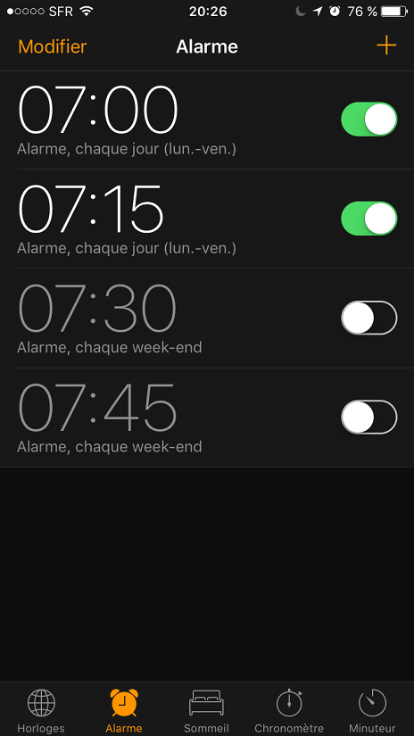

Okay, I _had_ to buy an iPhone one year ago or so, because I wanted a phone with more than 16go of space. Well, after around one year, here are a few thoughts. Enjoy.

**A**pple

The company we love to hate. I had 2 iPod Touch, the second one was a replacement of the first because of a jack

**B**attery

I was pretty happy for a few months, I didn't had to charge it during the day and still had 30% left ! It's not the case anymore. I have the freaking 30% battery bug: around 30-40% left, the phone shuts itself down. If I try to restart it, it asks me to plug it. I can try to restart it, and after 3 or 4 reboots, sometimes I can use it normally.

To sum up: the battery sucks and I have to stay at more than 40%... (To be continued... see the _Support_ part)

**C**amera

That is a pretty good point of the iPhone. Pictures are pretty cool !

**D**esign

Apple, the king of design.

When they switch to a flatter design and abandoned skeuomorphism, that was kind of a fail (even if a shitload of designers were fapping themselves because if you _think different_ than Apple you are a moron).

Now, with the nice, light and clean interface for all app, it became acceptable. For example:

WHAT. THE. HELL.

I thought that was a joke for halloween, but the Alarm app is still like that. Horrible and not practical.

Also, you can see that the «Modify» button is not a button but a label. Well, you know... Design... Fuck.

**E**conomic

I got a nice deal and my iPhone was not that expensive ^^

**F**ind apps

The App Store is really bad:

- the search is quite buggy
- I would have loved to be focused on the search input to open the keyboard when I touch the search icon ! Dammit !
- The update process fails really often, for example:
  - It won't update the app (never ending loading process in the update list)
  - Sometimes apps never finish to be installed. I have to restart the phone, uninstall an app, and install it again

**G**reat browser

In fact: you won't find one on the iPhone. Seriously, Safari... And fucking web views for other browsers...

**H**atestomp

[What I am currently feeling, writing this article.](https://genocidesuperstars.bandcamp.com/track/hatestomp)

**I**cloud

I really think Apple needs to improve the photo albums a lot.

For example: when you want to download an album of 170 pictures, you expect a nice archive. That is what you'll get: 170 pictures in your download folder. :clap: :clap:cra

**J**ack plug

I had this issue with my previous iPod touch, and it is still here: the headphone plug sucks, and it is already becoming fragile on my phone.

I understand why they removed it on iPhone 7 !

**K**ISS

[Explanation about KISS](https://en.wikipedia.org/wiki/KISS_principle)

Apple is often depicted as a company that makes products simple. The iPhone is not _that_ simple.

The best example for me is the notifications.

**L**auncher

The launcher and interface.

I really miss Android. The Apple launcher is really not for people who like to be organized ^^

- All icons are displayed at the top of the screens
- To reach icons from the top easily, you can you the «home button double press» trick. How about allowing to put icons at the bottom / borders near the thumb ?

**M**enus

The bottom menu (on swipe) became less usable.

We should be able to choose what to display. I don't care about AirPlay, AirDrop or Night Shift, but I listen to music a lot. I have no choice to move between the 2 panels.

**N**otifications

I don't remember how it was on ios9, but they suck on ios10.

- not grouped
- unclear what to do: pull, 3d touch ? Damn...
- when a notification appears, you can pull to display some things (action buttons) and it you try to touch a button _before_ the animation ends, there is no effect. Pretty boring.

**O**pen / Closed principle

When Apple tries to open things, they like to keep is closed to prevent you from using other apps.

- Keyboards: you can now install other keyboards (because the base one is not good), with a nice **DO YOU WANT THIS KEYBOARD TO READ YOUR THOUGHTS INSTEAD OF US OF OH PLEASE DON'T LET THEM HAVE THE FULL POWER BECAUSE WE WANT TO BE THE ONLY ONES SPYING ON YOU** (basically)
- Plans (if still installed) IS the default map app, you'll have to manually enter stuff to Google Maps (if that is your choice of maps apps).

**P**rograms

Well, apps. I miss the **Unknown sources** from Android soooo much !

**Q**uarashi

Some good hip hop / rock from Iceland: [Quarashi - Stun Gun](https://www.youtube.com/watch?v=5VNCWIqXYiw) !

**R**églages

Ok, settings, but I needed a word beginning with **R** ^^

I like the way the settings are organized and how the apps and notifications are listed. Very nice.

**S**upport

The support. _sigh_

Trying to find a way to solve the 30% battery bug, I contacted the [Apple Support](https://twitter.com/AppleSupport) on Twitter.

After allowing them to spy on my phone and giving them screenshots or my battery consumption, their piece of advice was:

> Stay up to date

There is a replacement plan from selected serial numbers. I am not in their range.

Seriously. Well, fuck you then, I'll go back to a real phone next time.

**T**ouch

It is basically cool only to swipe between your screens in the launcher. When I try to unlock my phone using a code (when the phone starts), I often have to try 2 times because the touch thing is not responsive enough to follow the 6 digits I input.

Also, sometimes you have to «touch» to many times. For example, the alarm screen. To change the time of an alarm, you have to touch the «modify» label

**U**sb

LOOOOOOOOOOOOOOL.

I have always thought that the proprietary Apple thingig to plug the iPhone was stupid. Not having to check the way when I plug it was actually a good surprise !

**V**arious apps you don't need

[Finally, we are able to remove default apps !!](https://support.apple.com/en-us/HT204221)

**W**idgets

Haha, nope.

**X**

[Xzibit - X](https://www.youtube.com/watch?v=H91kWpUNiwU)

**Y**early planned obsolescence

Dear iPhone,

I know you are starting to be fucked up because the 7th went out and you want me to buy it. Never again.

**Z**

I could not find the zoology track from their «Clones Live in Berlin», so here is another track:

[Puppetmastaz - The Bigger The Better](https://www.youtube.com/watch?v=HHxNu-o3sHk)
