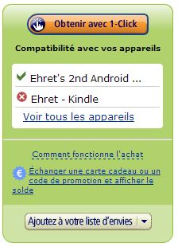

## 'sup

How are you ?
You can have a **free** audiobook when you register at [Audible](http://www.audible.com/).
Ain't that awesome ? (don't forget to cancel your account after if you don't want their membership).

## About le Kindle Fire

I received a Kindle Fire 7" a few months ago. I am very happy with the device, even without the Google Play Store.

## What's the problem ?

The kindle is an amazon product, Audible is an amazon company... Audible audiobooks seem to be available on the device ([see here](https://audible-uk.custhelp.com/app/answers/detail/a_id/4246/~/using-audible-on-your-kindle-fire-hdx)). But I'm french, and the french version of the Kindle doesn't have the "Audiobooks" menu option...

## What's the _real_ problem

There is a nice Audible app for android on the [Play Store](https://play.google.com/store/apps/details?id=com.audible.application) and Amazon [App-Shop](http://www.amazon.fr/Audible-Inc-pour-Android/dp/B004GJ6BY0/ref=sr_1_1?s=mobile-apps&ie=UTF8&qid=1398505601&sr=1-1&keywords=audible).

**BUT** it's not available for the Kindle.

> WHAAAAAAAAAAAAAAAT &mdash; _Siegfried Ehret_

## Solution

The solution is [sideloading](https://en.wikipedia.org/wiki/Sideloading).

You can't survive with a kindle without it.

I am using [Titanium Backup](https://play.google.com/store/apps/details?id=com.keramidas.TitaniumBackup) to save my apps from my phone and install them on the Kindle.

Apps are stored and compressed ([.tar.gz](https://en.wikipedia.org/wiki/Tar_gz)) in the following directory: `/storage/sdcard0/TitaniumBackup` (this may differ on your device).

You just have to retrieve the archive for your app, extract it and **booyah**, you get the [apk](<https://en.wikipedia.org/wiki/APK_(file_format)>), which is installable on the Kindle.

It works very well for the Audible app ;-).

Some apps requires more than the apk to work (ex: big games). Haven't tried installing one yet.
