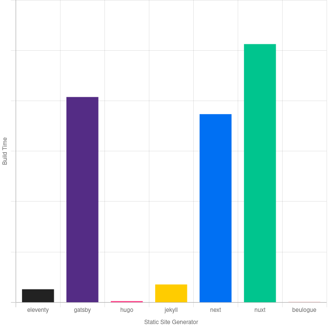
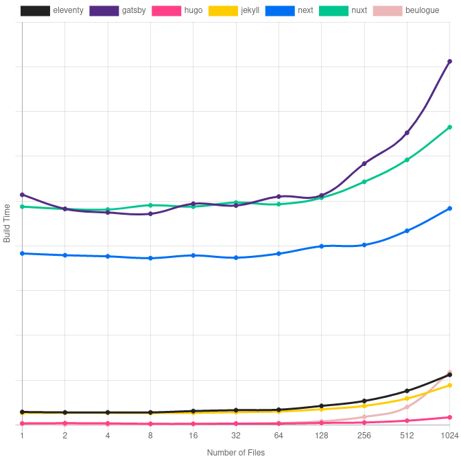
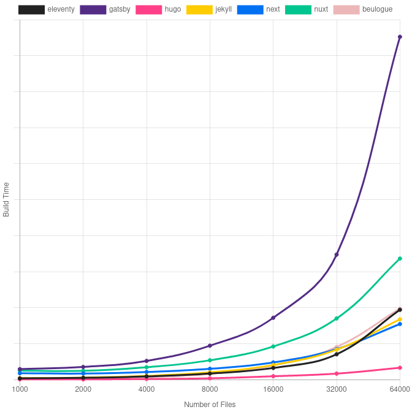

The [beulogue](https://github.com/SiegfriedEhret/beulogue/) adventure began a year and a half ago, to start playing with [Crystal](https://crystal-lang.org/).

## It was fast, and I made it slow

[hugo](https://gohugo.io/) is a great tool to generate a static site, but for me it brings to many things. A goal of `beulogue` is to be as simple as possible. That is why I made the choice of using [mustache](https://mustache.github.io/) as the templating engine in the beginning.

The problem I encountered is that I had to hack a bit in the templating engine to bring some [shortcodes](https://beulogue.ehret.me/en/content/shortcodes.html), which are not native in mustache.

A few weeks ago, I switch to a jinja-like templating engine (using [crinja](https://github.com/straight-shoota/crinja/)) to have shortcodes working in a less hacky way.

And this made beulogue "slow", here are the measures in beulogue v3 (with mustache) and v5 (with crinja):

beulogue v3:

- Site for language en (101 pages) built in 171.31ms.
- Site for language fr (16 pages) built in 27.98ms.

beulogue v5

- Site for language en (101 pages) built in 578.65ms.
- Site for language fr (16 pages) built in 152.27ms.

😯 beulogue v4 does not exist! beulogue uses only numbers from the Fibonacci sequence!

## A benchmark for static site generators

I discovered the following article: [Comparing Static Site Generator Build Times](https://css-tricks.com/comparing-static-site-generator-build-times/), which benchmarks the following site generators:

- [Eleventy](https://www.11ty.dev/)
- [Gatsby](https://www.gatsbyjs.com/)
- [Hugo](https://gohugo.io/)
- [Jekyll](https://jekyllrb.com/)
- [Next.js](https://nextjs.org/)
- [NuxtJS](https://nuxtjs.org/)

Time to try with `beulogue`! Please note that this benchmark only study the number of document processed, generating a lot of lorem ipsum markdown documents.

I forked the [original repository](https://github.com/seancdavis/ssg-build-performance-tests) into [this one](https://github.com/SiegfriedEhret/ssg-build-performance-tests) where I have added beulogue (see [this commit](https://github.com/SiegfriedEhret/ssg-build-performance-tests/commit/723501b7beb47ed0d2a0049199619b5c7e131d57)).

Oh, and my computer is quite old so everything runs quite slowly.

### Base

For the "base" dataset, we run each generator on 1 document only.

beulogue wins! :trophy:

### Small dataset

For the "small" dataset, we run each generator on [0, 1, 2, 4, 8, 16, 32, 64, 128, 256, 512, 1024] documents.

beulogue performs quite well, close to Hugo for small sites, with a weird progression to join Eleventy in the end. Let's see how it goes for larger sites.

### Large dataset

For the "large" dataset, we run each generator on [1000, 2000, 4000, 8000, 16000, 32000, 64000] documents. This takes quite some time!

beulogue stays close to Eleventy. Jekyll and Next.js are a bit faster.

## The performance issue

When I ran the benchmarks, in particular the ones with a lot of files (about 4000 markdown files), I noticed that the performance was less and less good.

I used the [Time API](<https://crystal-lang.org/api/0.35.1/Time.html#measure(&):Time::Span-class-method>) from Crystal to find the hot point(s).

I managed to fix the issue which was pretty dumb, as usual: I created a new template parser for each page, but I only really needed one!

The fix is part of beulogue v5.1.0 and we are close to the performance of v3!

## beulogue is fast enough

beulogue generates a 64000 pages sites in 95 seconds on my old computer.

It is fast enough.

On a side note, beulogue is available on

- [GitHub](https://github.com/SiegfriedEhret/beulogue)
- [Bitbucket](https://bitbucket.org/siegfriedehret/beulogue)
- [GitLab](https://gitlab.com/SiegfriedEhret/beulogue)
- [Codeberg](https://codeberg.org/SiegfriedEhret/beulogue)
- 🆕 [sourcehut](https://git.sr.ht/~siegfriedehret/beulogue).
