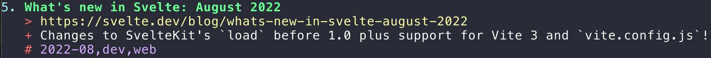

I have been looking for something to keep my bookmarks. I have been a long time user of [pinboard](https://pinboard.in) and I was looking for a self-hosted or a non-hosted service. And I discovered [buku](https://github.com/jarun/buku).

So let's see what buku is about!

## What is buku?

> `buku` is a powerful bookmark manager and a personal textual mini-web.

buku is a terminal application, and it also comes with a web based GUI (I have not tried it).

The GitHub repository is [https://github.com/jarun/buku](https://github.com/jarun/buku), it is made by [jarun](https://github.com/jarun) who also created [nnn](https://github.com/jarun/nnn), which is another tool that I use a lot and I wrote a bit about it [here](https://ehret.me/nnn-101).

buku is made in Python which, as all Python programs I had troubles to make it work. I hope you can find a package for your OS so it can work out of the box.

## Using buku

### Adding a bookmark

This is done with `buku -a <url> <tag1, tag2>`, and buku displays the entry:



Note that buku fetches the title for you.

You can also use `buku -w` to open your favorite editor - which should be [Kakoune](https://kakoune.org/) - and fill all the details yourself.

### Searching for bookmarks

```shell
❯ buku javascript
1. Everything You Need to Know About JavaScript Import Maps - Honeybadger Developer Blog [6]
   > https://www.honeybadger.io/blog/import-maps/
   + Import maps are a new way for web pages to control the behavior of JavaScript imports, potentially enabling you to ditch your build system. In this article, Ayooluwa
     Isaiah dives deep into the specification.
   # 2022-08,dev,web

2. Navigation API: la navigation côté client la plus moderne - DEV Community [61]
   > https://dev.to/this-is-learning/navigation-api-la-navigation-cote-client-la-plus-moderne-33po
   + Introduction Les SPAs, Single Page Application, sont caractérisées par une fonctionnalité... Tagged with javascript, webdev, news, productivity.
   # 2022-08,dev,fr,web

1-2/2
buku (? for help)
```

The number between brackets (like `[6]` and `[61]`) is the id of the bookmark in the database. Useful for the next actions.

### Editing a bookmark

Use `buku -w <id>` which opens your editor, allowing you to edit this entry:

```shell
# Lines beginning with "#" will be stripped.
# Add URL in next line (single line).
https://www.honeybadger.io/blog/import-maps/
# Add TITLE in next line (single line). Leave blank to web fetch, "-" for no title.
Everything You Need to Know About JavaScript Import Maps - Honeybadger Developer Blog
# Add comma-separated TAGS in next line (single line).
2022-08,dev,web
# Add COMMENTS in next line(s). Leave blank to web fetch, "-" for no comments.
Import maps are a new way for web pages to control the behavior of JavaScript imports, potentially enabling you to ditch your build system. In this article, Ayooluwa Isaiah dives deep into the specification.⏎
```

### Removing a bookmark

Use `buku -d <id>`, buku asks for confirmation.

### Importing / Exporting bookmarks

buku can import bookmarks from browsers with `buku -ai`, and import from / export to various file formats, using `buku -i` / `buku -e`

For example, `buku -e links.md -t "2022-08"` creates a `links.md` file matching the tag "2022-08". buku also shows the list of matching links in the terminal and the number of links exported.

## Bonus

### REPL

Using buku, you get a nice [REPL](https://en.wikipedia.org/wiki/Read%E2%80%93eval%E2%80%93print_loop):

```shell
❯ buku
buku (? for help) ?

PROMPT KEYS:
    1-N                    browse search result indices and/or ranges
    O [id|range [...]]     open search results/indices in GUI browser
                           toggle try GUI browser if no arguments
    a                      open all results in browser
    s keyword [...]        search for records with ANY keyword
    S keyword [...]        search for records with ALL keywords
    d                      match substrings ('pen' matches 'opened')
    r expression           run a regex search
    t [tag, ...]           search by tags; show taglist, if no args
    g taglist id|range [...] [>>|>|<<] [record id|range ...]
                           append, set, remove (all or specific) tags
                           search by taglist id(s) if records are omitted
    n                      show next page of search results
    o id|range [...]       browse bookmarks by indices and/or ranges
    p id|range [...]       print bookmarks by indices and/or ranges
    w [editor|id]          edit and add or update a bookmark
    c id                   copy url at search result index to clipboard
    ?                      show this help
    q, ^D, double Enter    exit buku

buku (? for help)
```

To skip the REPL, use `--np`

### Alias

As described in the [README](https://github.com/jarun/buku), we can have a short and sweet alias:

```shell
alias b='buku --suggest'
```

### A function for my shell

A [fish shell](https://fishshell.com/) function to add something, and automatically add a `<year>-<month>` tag:

```shell
❯ cat ~/.config/fish/functions/ba.fish
function ba --argument-names link
    set --local tags (string join ", " $argv[2..-1])
    set --local d (date +"%Y-%m")

    buku -a $link $tags, $d
end
```

I call it like this:

```shell
❯ ba "https://avestura.dev/blog/zero-knowledge-proofs" dev various
16. Understanding zero-knowledge proofs
   > https://avestura.dev/blog/zero-knowledge-proofs
   + What are zero-knowledge proofs, really?
   # 2022-08,dev,various
```

## The end

Et voilà ! I hope you give buku a try, the repository is [here](https://github.com/jarun/buku)!

Most commands bring you back to the REPL (except if you use `--np`), from there `?` will show you the help, and `buku --help` is also here for you.

Enjoy!
