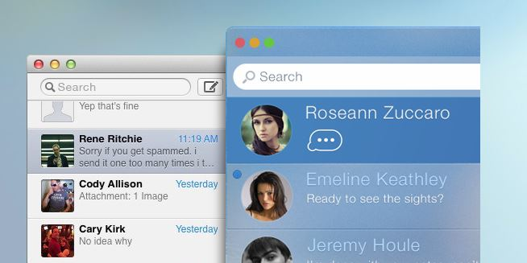
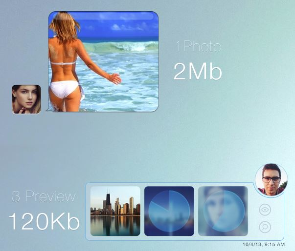
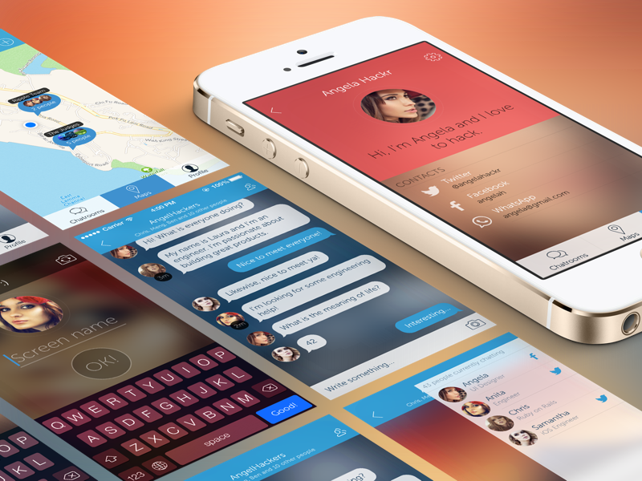

## Intro

If you haven't subscribed to [Sidebar](http://sidebar.io/), you should. It is super cool and brings 5 design related links everyday.

Recently, this came out: [Messages redesign by Ramotion](http://www.behance.net/gallery/Messagesapp-Concept/12081377), showing a revamped Messages.app design :

Then, [this post](http://blog.wells.ee/guys-stop-sexualizing-women-in-your-mockups/) happened, calling for an end of using sexy women in mockups (great article !).

I think the same rule can be applied to the design target.

## What's happening here.

> Oh yeah, kind of flat and blurry, reminds me of something...

This concept is just an iOS7 styled Messages.app remake.

Is everything wrong ? Not at all.
This idea of multiple thumbnails instead of a big picture is pretty sweet:

The design is very nice and **you already know it because you know how iOS7 looks**.

## What's happening there

This [article](http://blog.wells.ee/guys-stop-sexualizing-women-in-your-mockups/) also shows the [Ripple location based chat app](https://medium.com/design-ux/bb582274b93f)

It is very nice too. And it is again an iOS7 styled app... And that's their goal: designing for iOS7.

## About design

I am a developer (meaning I don't know anything about design) but this is what design means for me.

> Design is the process of creating innovative things

These design concepts are designs from the past, applying existing things (iOS style) to existing apps.

This may be the limit between art and design: both are creation related processes. One tries to innovate, the other tries to copy and adapt.

## Last words

> STOP PIMPING AND START CREATING &mdash; _Siegfried Ehret_

I am not saying designers can't create. I am saying that they should stop pimping Apple related product or app to gain recognition.

Systems' and OSes' guidelines are not goals, they are constraints. They motivate designers to join a _fashionable design_ but they are restraining their imagination from artistic innovation.

And I will try to apply the same rule to myself in development related stuff.
