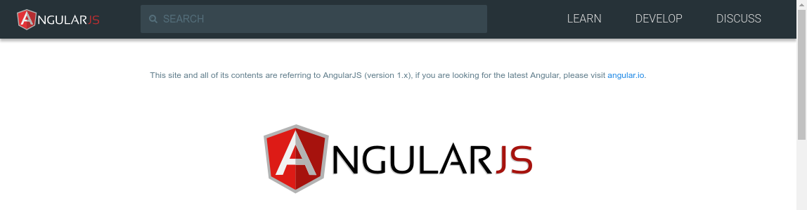
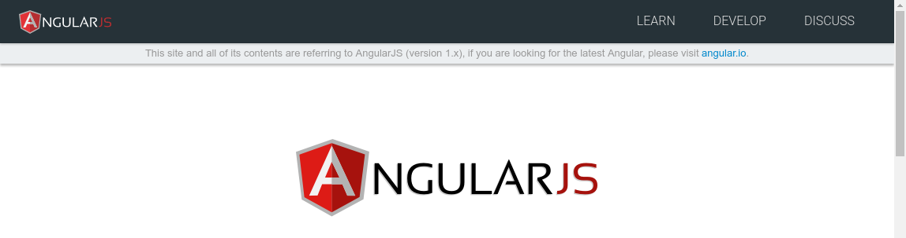

(sorry, this is again a rant about some Angular thing...)

What is the difference between:

and

?

Yep. The search bar was removed from the [AngularJS](https://angularjs.org/) website.

## Why ?

From a coworker (Google fanboy):

> We are starting to re-route people to [angular.io](https://angular.io/)

## Whaaaaaaaat ?

As I see it, the Angular team wants to make access to AngularJS things harder, starting with reaching the documentation.

I can't wait to see their next move.

[Slipknot - Left Behind](https://www.youtube.com/watch?v=D1jQKpse7Yw)
