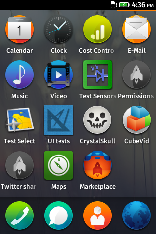
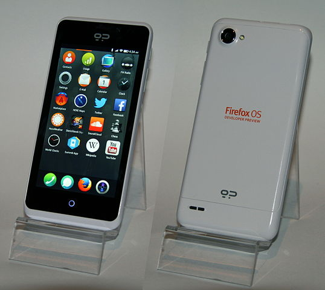

## Why FirefoxOS ?



(image from [here](https://developer.mozilla.org/en-US/Firefox_OS/Platform/Gaia/Introduction_to_Gaia))

## The phone



(image from [Wikipedia](https://en.wikipedia.org/wiki/File:GeeksPhone_Peak_-_front_and_back.jpeg))

The [Geeksphone Peak](https://en.wikipedia.org/wiki/GeeksPhone_Peak) was released in April, 2013 as a Developer Preview phone... And I have one ^^.

## Easy way

[Geeksphone](http://downloads.geeksphone.com/) has all the drivers and updates you need.

You may also need some tricks from [here](https://hacks.mozilla.org/2013/05/pushing-firefox-os-apps-to-the-geeksphone/).

For example, Linux users will need this in `/etc/udev/rules.d/51-android.rules.`:

```text
SUBSYSTEM=="usb", ATTR{idVendor}=="05c6", MODE="0666", GROUP="plugdev"
```

then,

```shell
chmod a+r /etc/udev/rules.d/51-android.rules
sudo service udev restart
```

Then, skip to the flashing part of this article.

## Not-so-easy way

Actually, it was quite easy, but you will need one quality: patience !

Everything is very well detailled in the following links:

- [Build prerequisites](https://developer.mozilla.org/en-US/Firefox_OS/Firefox_OS_build_prerequisites)
- [Preparing the first build](https://developer.mozilla.org/en-US/Firefox_OS/Preparing_for_your_first_B2G_build)
- [Installing on the phone](https://developer.mozilla.org/en-US/Firefox_OS/Installing_on_a_mobile_device)

So... Why this article if it's so easy ?

## Japanese keyboard

Yep... The big regret I had using Geekphone's versions was the lack of Japanese keyboard.

でも... [There is one](https://github.com/mozilla-b2g/gaia/tree/master/apps/keyboard/js/imes/jskanji) !
Why so absent ?

Because it is heavy. As in really heavy. The dictionary file is something like 22mb.

With some help from [this bug](https://bugzilla.mozilla.org/show_bug.cgi?id=933252), I now have a japanese keyboard on FirefoxOS.

## Building and installing

Here are some steps to enable this thing (everything can be found in the previous build & installing links).

### Prerequisites

Let's enable i386 architecture (because we are all on 64 bits systems, right ?)

```shell
sudo dpkg --add-architecture i386
sudo apt-get update
```

Then, let's install some dependencies and compilers

```shell
sudo apt-get install --no-install-recommends autoconf2.13 bison bzip2 ccache curl flex gawk gcc g++ g++-multilib gcc-4.6 g++-4.6 g++-4.6-multilib git lib32ncurses5-dev lib32z1-dev zlib1g:amd64 zlib1g-dev:amd64 zlib1g:i386 zlib1g-dev:i386 libgl1-mesa-dev libx11-dev make zip libxml2-utils

sudo update-alternatives --install /usr/bin/gcc gcc /usr/bin/gcc-4.6 1
sudo update-alternatives --install /usr/bin/gcc gcc /usr/bin/gcc-4.8 2
sudo update-alternatives --install /usr/bin/g++ g++ /usr/bin/g++-4.6 1
sudo update-alternatives --install /usr/bin/g++ g++ /usr/bin/g++-4.8 2
sudo update-alternatives --set gcc "/usr/bin/gcc-4.6"
sudo update-alternatives --set g++ "/usr/bin/g++-4.6"
```

You will also need some android tools

```shell
sudo apt-get install android-tools-adb android-tools-fastboot
```

### Tons of files !

You'll need 20go of space, and some time. Everything is automated, but you have to look at what happens in your terminal, because you may encounter THE MATRIX. Oh yeah.

```shell
git clone git://github.com/mozilla-b2g/B2G.git
cd B2G
./config.sh peak
```

### Extra configuration

Now is the time to configure your japanese keyboard.

Let's go here: https://github.com/mozilla-b2g/gaia/tree/master/apps/keyboard/js/imes/jskanji

We will need an ipadic release from [here](http://sourceforge.jp/projects/ipadic/releases/), and do what's said in the README file

- Extract all .dic files to dict/ipadic/.
- Run `make` under the `dict` directory to generate dict.json.

This will generate the dictionary file used by the keyboard.
**The keyboard is not enabled yet**. I went to the next part without enabling at first... Baaaad idea !

[This page](https://developer.mozilla.org/en-US/Firefox_OS/Building#Building_multilocale) explains how to enable the multilocale stuff.

I choose the lazy way by editing `<B2G folder>/gaia/Makefile`, changing the `GAIA_KEYBOARD_LAYOUTS` line:

```text
GAIA_KEYBOARD_LAYOUTS?=en,fr,jp-kanji
```

That's it !

### Building

The phone should be connected to the computer, and:

```shell
./build.sh
```

### Flashing


(image from [Wikipedia](https://en.wikipedia.org/wiki/File:Garrick_ross.jpg))

On the Geeksphone Peak, the [bootloader](https://en.wikipedia.org/wiki/Booting) was locked.

So... Remember the android tools we installed earlier ? adb and fastboot ? Let's play with them:

```shell
adb reboot bootloader
sudo fastboot oem unlock
```

You'll see chinese written stuff. Press volume up key to change the selected checkbox, then the power key to submit the change ([thank you](http://javaguirre.net/2013/05/06/flashing-firefox-os-geeksphone-peak/)).

Back to flashing !

```shell
./flash.sh
```

More info on flashing only some part [here](https://developer.mozilla.org/en-US/Firefox_OS/Installing_on_a_mobile_device).

## And ?

That's all !


(image from [here](https://www.mozilla.org/fr/firefox/os/))

Well. Not so fast. We built and flashed the _master_ branch, which may not be the most stable one. Please go [here](https://developer.mozilla.org/en-US/Firefox_OS/Preparing_for_your_first_B2G_build#Building_a_branch_2) to learn how to build a specific branch.

You should definitely give FirefoxOS a try if you can. It's powered by the web, and everybody who can do some web can create an app. Ain't that amazing ?

You can also play with the [simulator](https://developer.mozilla.org/en-US/docs/Tools/Firefox_OS_Simulator), which is a Firefox add-on.

Also, you can find tons of good stuff on the [Mozilla Developer Network](https://developer.mozilla.org/en-US/Firefox_OS).
