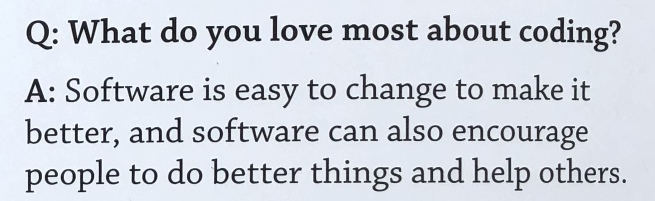

## What ?

[Lorie - La positive attitude (Clip officiel)](https://www.youtube.com/watch?v=gb4yPEMh24E)

## Seriously ?

> No.

In my [To 2018 and beyond](https://ehret.me/en/to-2018-and-beyond) post I said that I wanted to be more positive. I also wrote about the things I do not want to spend my personal time on.

Let's see...

- Chatbots and assistants: these are not interfaces I want to use, and I think they are «just» API calls, not really interesting for me.
- Mobile: I have never been found of mobile development (but I like web development), and I still do not want to develop using native mobile languages, and I do not really like using a «mobile framework» like Ionic or things like that.
- Blockchain: how can you trust something that is hacked more often than the releases of new JavaScript frameworks ?

What about the things I want to lose track of time ? Here they are, in alphabetical order.

### Angular

I have been excessively critical about some things about Angular. I would like to have a real project using it to see what it is like in the real world. Last year I only used it on a training project and it was not enough for me to embrace it.

Where I am with Angular today: it has the same concepts than AngularJS, but everything is just more complicated.

### ClojureScript

I talked about this one, I have already played a little with LISP (so I do not fear the parenthesis!) and I like the thing so far.

### Infrastructure as code

I do not know why, but I like the idea ^^. I really want to play with things like [Terraform](https://www.terraform.io/). This will be a brand new world for me !

### Serverless

I have played a little with [AWS Lambda](https://aws.amazon.com/lambda/) last year and I want to have more fun with this stuff. I will start playing with [Up](https://up.docs.apex.sh) soon !

### Rust

I tried some things last year. I was «whaaaat»-ing when, after doing `s3 = s1 + &s2;` you can not refer to `s1` anymore. well. The step to join the rust bandwagon is not an easy one, but I think I should go deeper to learn Rust's concepts.

### Typing JavaScript

Reminder: there are types in JavaScript: `number`, `string`, `symbol` etc :smile:

This is not a «TypeScript» category because the tool does not matter.

Types in JavaScript surely help a lot of projects and even if I have not used this tool for real.

By the way, I think [Flow](https://flow.org/) is a better match for me.

## Conclusion

I hope that I will be able to find enough time to do this things.

More importantly, I hope that I will be able to find the right tool to solve a problem.

Let's end this with a quote from a recent blog post from Jett Atwood: «[To Serve Man, with Software](https://blog.codinghorror.com/to-serve-man-with-software/)»,

