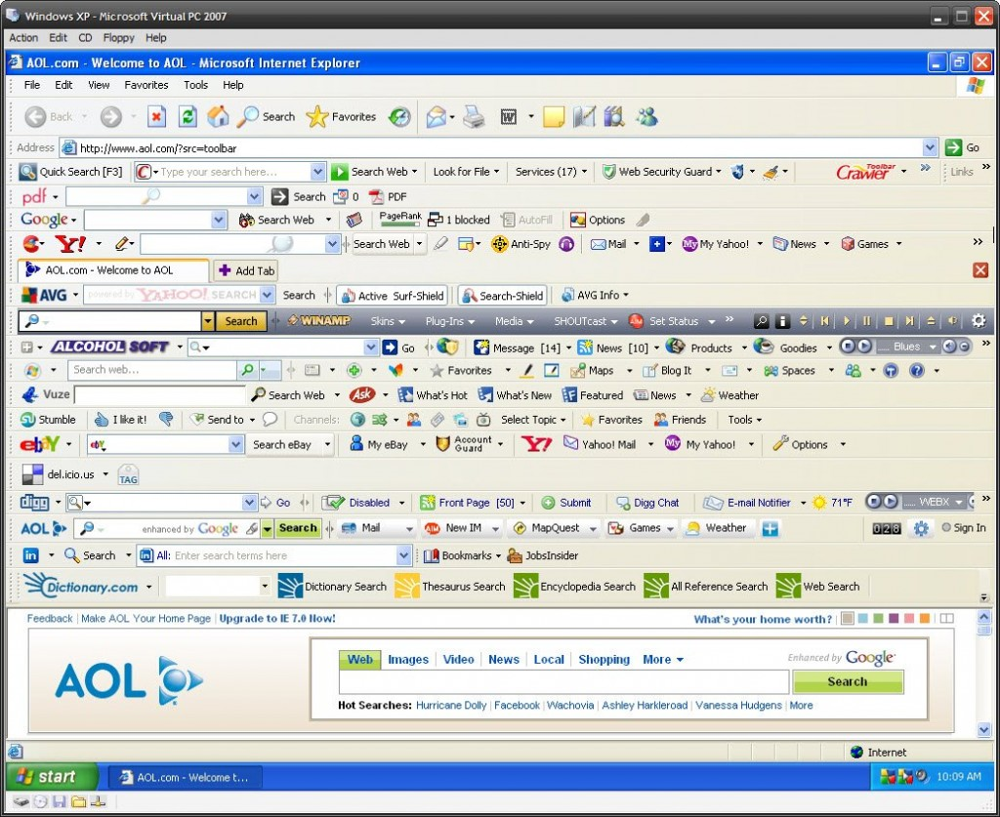
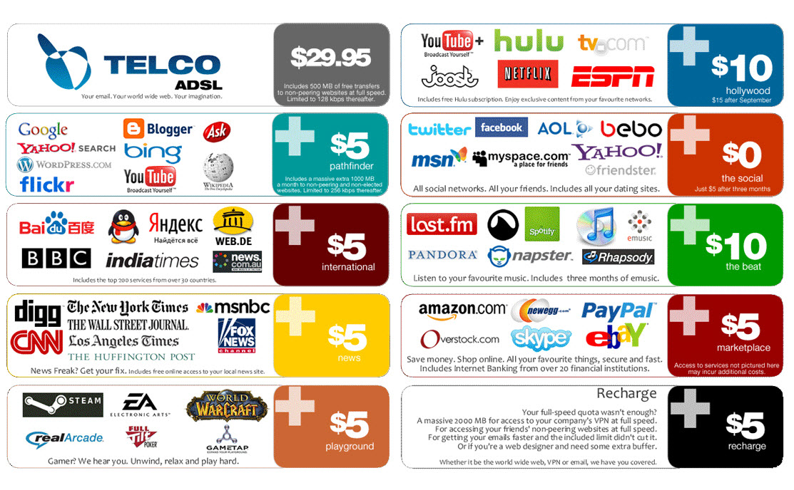

I found this on reddit. I put this here to keep it somewhere. All credits to [this comment by u/Forgive_My_Cowardice](https://www.reddit.com/r/nottheonion/comments/7mqap0/people_keep_uploading_hamilton_to_pornhub/drwc9x5/).

I added the images in the post, instead of linking them as in the comment

---

It's like a skill tree.

Level 0:

Level 1: Google, Hotmail

Level 2: PornHub, XNXX, incognito mode, Gmail

Level 3: Wayback Machine, streaming sites, using Google Translate to maximize porn results. Bing for porn. Sorting subreddits by top of all time. Noticing the save button underneath every Reddit post and comment

Level 4: Torrents, shift-tab, ctrl-tab, ctrl-shift-tab, ctrl all the things! Hotkeys, firewalls, ports can be selectively enabled, disabled, triggered, forwarded, and monitored. MLG and Twitch. Newsgroups. First stirrings of interest in furryporn and clop-clop. Aktually becomes a commonly used word. WOW, LoL, Runescape 2007, Eve, Starcraft (pick two to proceed)

Level 5: Cryptomining and custom Linux distros, seeding torrents, tingly sensation when MLP or TNG theme songs are played. BitTorrent trackers and private trackers. Shrek is love. Redpill/Bluepill unavailable, Skittles symbolically consumed instead. GPU has more clean liquid running across it weekly than you do. lol replaced by kek, which is quickly replaced by topkek. MtG, Pokémon, or DnD (pick one to proceed)

Level 6: Dark web, using torrents to download cracked torrents, learning that Lolita = CP (and they aren't bluffing). Access to crackerware and brute-force libraries. Unnatural aversion to direct sunlight and increased appetite for sugary carbonated beverages. GBP freely exchanged for tendies. Niceguy achievement unlocked

Level 7: btc mixers, whitehat/blackhat for hire, wetworks for hire (dubious at best). Auto killswitches for VPN lag, BIOS level deathswitch with mulifactor ID verification. Odd obsession with watching unsecured webcams continues to grow. Porn now exclusively 2D or VR, everything else is for normies. Attempts to summon Gaben fail, but it's not ogre yet

Level 8: Single use .tor and .onion sites, creation of dark web nodes, Silkroad clones, and stripped TAILS. Contact made with infamous hacker known only as "4chan" (air quotes required). Admin user changed from root to root2. Initial start up time is sub 5 seconds for an OS that supposedly never requires restart. Increased outrage that Dogecoin is not accepted at major retailers

Level 9: No hard drive USB OS, botnet utilization for IP obfuscation, custom made broad-spectrum VPN's. Energy drinks now a food group, taste in music skews to obscure "sounds" (for lack of a better word). Traps aren't gay after all. Rare memes become disturbingly important, possible correlation between ogre and .onion? further research required. Rickrolling replaced by 2 Girls 1 Cup. Anon feels like your true name.

Level 10: Stuxnet source code stored in encrypted USB and worn as necklace, ransomware deployment to Internet security firms for the lulz, CPU replaced with pre-2003 hardware to avoid boot level exploits courtesy of NSA/CIA. Ironic T-shirts about Rick and Morty inexplicably appear without being ordered. Renting botnets by the hour now available. Greentext becomes the only suitable medium for true art

Level 11: Hunter-Seaker viral loads, 0-Day exploits for major anti-virus applications, active deployment of infected USB sticks by leaving them in parking lots at universities and government research facilities (with car keys to exploit social engineering). TB's of furry and hentai "art" stored in Faraday cage and secured with a high-school combination lock. Shrek is life. 2 Girls 1 Cup replaced by 1 Man 1 Jar. Is smegma technically lube? It's my privilege to ask /b/.

Level 12: Dumb AI research and development in double quarantined virtual machines, Windows auto-updates permanently removed, photoshopped iPhone ads encouraging users to microwave their iPhone to increase battery life, Baneposting supersedes shitposting

Level 13: Self-improving software, ability to refer to greyhats as "script kiddies" if they didn't literally write their own distro

Level 14: Constant terror of, and desperate yearning for, The Singularity. Neckbeard now required to sustain life. Strong opinions on the differences between nerds and geeks froth and foment beneath the Adderall-infused mind. At least one password is a variation of "checkem"

Level 15: The sight of "@aol.com" now causes physical pain, not unlike a vampire being exposed to a cross. Primary source of exercise is aggressive masturbation. Most viewed websites now end in .tor, .onion, or are irritatingly long strings of random characters for no god-damned reason at all

Level 16: True joy can only be found in doxxing people with the **WRONG** opinion about the latest Linux distros. The omnipresent hum of unnecessarily over-clocked 1080 TI's has caused permanent hearing loss. Windows auto-update on virtual machine crashes Mint (you didn't actually write your own distro after all). Quints now predict the future, meme-magic has a taste, and it's surprisingly similar to Szechuan Sauce

Level 17: Bodily fluids routinely stored in Mountain Dew bottles, ability to DDOS all but the largest websites on the planet with massive botnet army

Level 18: Become FCC Chairman because fucking the entire Internet gives you a sense of pride and accomplishment.

Ability to see the future..

