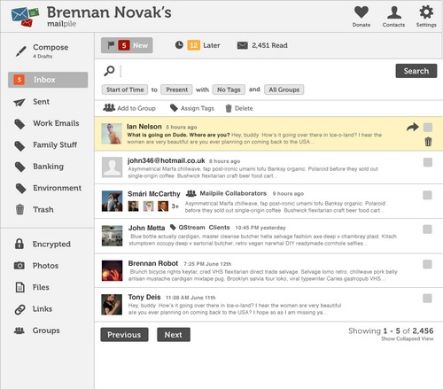

## intro

[Mailpile](https://www.mailpile.is/) is "a modern, fast web-mail client with user-friendly encryption and privacy features. 100% Free and Open Source software".

After contributing to the french language version ([look mum, my name is here !](https://github.com/pagekite/Mailpile/commits/master/locale/fr_FR)), I decided to give it a try.

> This is pre-ALPHA quality code! Please expect everything to be broken. (from [Mailpile readme file](https://github.com/pagekite/Mailpile))

Mailpile is more an epic mail search engine with a frontend than a client.

We need a bunch of mails saved locally (for now. IMAP sync is in development, see "Importing and Protocols" [here](https://www.mailpile.is/#features)). And you'll need to configure an smtp client for sending mails (I haven't tried that).

## offlineimap

OfflineIMAP is an IMAP synchronization utility software, capable of synchronizing mail on IMAP server with local Maildir folder or another server ([thank you wikipedia](https://en.wikipedia.org/wiki/OfflineIMAP)).

You will need to create a `.offlineimaprc` file in your home directory with the following contents:

```text
[general]
accounts = FastMail
metadata = ~/Mail/.offlineimap
maxsyncaccounts = 1

[Account FastMail]
localrepository = LocalFM
remoterepository = RemoteFM

[Repository LocalFM]
type = Maildir
localfolders = ~/Mail/fastmail

[Repository RemoteFM]
type = IMAP
remotehost = mail.messagingengine.com
remoteport = 993
remoteuser = my.name@fastmail.fm
remotepassfile = ~/.config/offlineimap/my.name.fastmail.fm
ssl = yes
cert_fingerprint = 05:0E:9B:F2:0F:0E:4C:DE:F9:8B:D3:2D:9B:FB:B6:CE
expunge = no
folderfilter = lambda foldername: foldername not in ['INBOX.Trash']
maxconnections = 3
```

You need to create:

- the folder `~/Mail/fastmail` which will receive your mails
- the file `~/.config/offlineimap/my.name.fastmail.fm` which contains your password.

More info about ssl and cert_fingerprint [here](http://fastmail.wikia.com/wiki/ConfiguringFetchmail).

Then, when you run the command `offlineimap`, it should start retrieving your emails. All of them. Be patient :-).

For non-testing purpose, you can add a cron task to call offlineimap regularly.

## mailpile

### initialization

Creation of mailpile folder where it will store indexes and all stuff related to your emails:

```shell
./mp --setup
```

Give Mailpile some information about you:

```shell
./mp --set "profiles.0.email = my.name@fastmail.fm"
./mp --set "profiles.0.name = My Name"
```

And add your mail folder:

```shell
./mp --add /home/mailpile/Mail/fastmail/ --rescan all
```

It will scan all your mailbox subfolder, extracting data to feed its indexes.

### launch the server

Enabling Mailpile to be called from another computer:

```shell
./mp --set sys.http_host=0.0.0.0
```

Launching the server:

```shell
 ./mp --www
```

Then, go to your server on port 33411 to see Mailpile's frontend: http://my-server.com:33411/

You should see Mailpile interface:



## nginx

Here is my nginx configuration to redirect request to mailpile without using its 33411 port.

My example is: /etc/nginx/sites-available/mail.my.server.com

```text
server {
  listen 80;
  server_name yourdomain.com;
  return 301 https://$host$request_uri;
}

server {
  listen 443 ssl;
  server_name yourdomain.com;

  ssl_certificate /home/path/to/the/certificate/certificate.pem;
  ssl_certificate_key /home/path/to/the/certificate/myserver.key;

  # optional: tell browsers to require SSL
  add_header Strict-Transport-Security max-age=31536000;
  root /home/mailpile/Mailpile/;
  try_files $uri @mailpile;

  location @mailpile {
    proxy_pass http://localhost:33411;
    break;
  }
```

Then:

- go to `/etc/nginx/sites-enabled`
- run `ln -s ../mail.my.server.com` as root to enable the new site
- `nginx -t` to validate the config
- run `service nginx restart` as root to restart the server.

## conclusion

Mailpile is easy to install and run (for an alpha software !) and the UI is nice (and in progress !). It will definitely be worth the try in a few months.

> Alpha version this after new years and hopefully a beta summer 2014! A full release hasn't been scheduled. (https://twitter.com/MailpileTeam/status/406700289756901376)

There is also a CLI interface (describe in the project's [readme file](https://github.com/pagekite/Mailpile)).

Go to [their website](https://www.mailpile.is/) to learn more about the project and support these guys !
