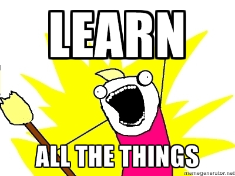

Dear visitor,

I hope everything went well in 2014 and my only wish for this new year is that you make it awesome.

My program for this year:

## Writing

I want to give this blog a real life (sorry, the pinky theme will stay).
I will start soon with an article on "Be nice 101". Stay tuned !

## Speaking

I made a few "corporate" talks last year:

- [GulpJS](http://slides.com/siegfriedehret/gulpjs#/)
- [node-webkit](http://slides.com/siegfriedehret/node-webkit#/)

I want to go further and give talks at meetups etc.

## Learning

Last year, I finished the [Functional Programming Principles in Scala](https://www.coursera.org/course/progfun) coursera, I had a CSS workshop with [Raphaël Goetter](http://goetter.fr/) from [alsacreations](http://www.alsacreations.com/).

I will continue to use and discover:

- Web technologies: HTML, CSS, JavaScript
- [Angular](https://angularjs.org/)

I plan to dive into (I will not have enough time for everything...):

- [react](https://facebook.github.io/react/)
- [meteor](https://www.meteor.com/)
- I want to finally digest the macro chapter of [Practical Common Lisp](http://www.amazon.com/Practical-Common-Experts-Programming-Languages/dp/1430242906/)
- Machine Learning and all this big data thingie

Also, I want to learn more things, starting now: [Dino 101](https://www.coursera.org/course/dino101) !

## Keeping on

This year, I will keep on:

- [Tweeting](https://twitter.com/SiegfriedEhret) and [app.net-ing](https://alpha.app.net/siegfriedehret)
- Having fun with my job
- Sharing things with others
- Reading my code a few months later and think "haha that was so dumb"
- Trolling (in a fun way, I will explain that in the "Be nice 101" post !)
- Learning Karate: 15 years without sport, and I started karate in last september

## Peace ?

Peace.
