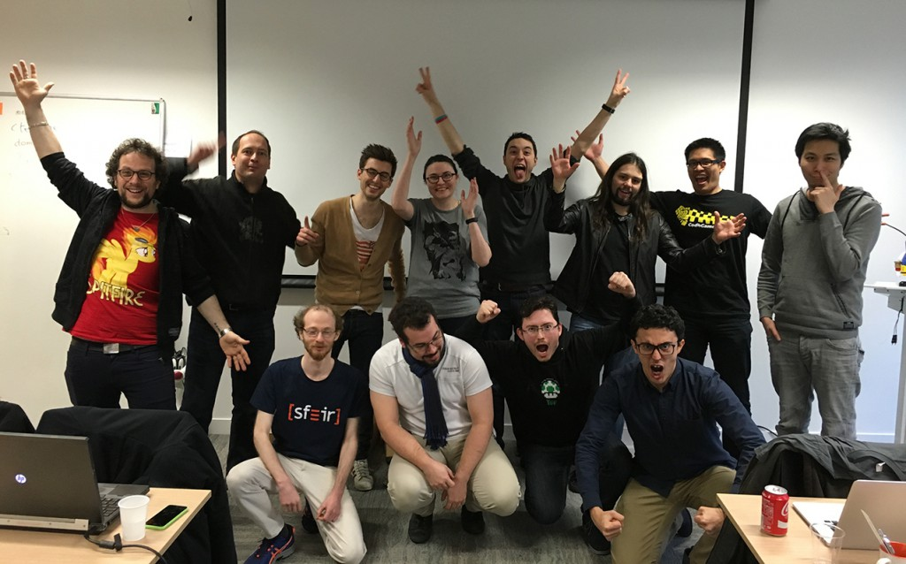

It's that time again...

Last year, I added some «interludes» with music I like or something, you'll find the same in this new one.

## Writing

I wrote some articles on this blog (10 !). I think the most viewed one was the one about TypeScript (I do not have any analytics / tracking stuff on this website so I do not have any proof though).

I did some real things again for [sfeir](http://www.sfeir.com):

- [devoxx report](https://lemag.sfeir.com/devoxx-fr-debrief-de-ledition-2016/)
- An [interview](https://lemag.sfeir.com/interview-de-raphael-goetter/) of [Raphaël Goetter](https://twitter.com/goetter) at [Best of Web](http://bestofweb.paris)
- An [interview](https://lemag.sfeir.com/interview-javascript-et-golo-expliques-par-philippe-charriere-github/) of [Philippe Charrière](https://twitter.com/k33g_org) at the [jug summer camp](http://www.jugsummercamp.org/edition/7)
- An [interview](https://lemag.sfeir.com/interview-matt-holt/) of [Matt Holt](https://twitter.com/mholt6) at [dotGo](http://www.dotgo.eu)

And some small contributions in the articles of awesome coworkers:

- An [interview](https://lemag.sfeir.com/interview-alexis-moussine-pouchkine-google-explique-kubernetes/) of [Alexis Moussine-Pouchkine](https://twitter.com/alexismp) at the [jug summer camp](http://www.jugsummercamp.org/edition/7)
- [dotGo report](https://lemag.sfeir.com/debrief-dotgo-2016/)

I had a ticket for [dotCSS](https://www.dotcss.io) and [dotJS](https://www.dotjs.io) but I fucked up when planning my holidays... So I skipped the conf to stay in Japan. No report for these confs, sorry !

This will not stop in 2017 ^^.

Interlude: [A Tribe Called Quest - We The People....](https://www.youtube.com/watch?v=vO2Su3erRIA)

## Speaking

That was a crazy year.

With my buddy [Romain Maton](https://twitter.com/rmat0n), we spoke at:

- [devoxx](http://devoxx.fr)
- [jug summer camp](http://www.jugsummercamp.org/edition/7)
- [soft shake](http://archive.soft-shake.ch/2016/en/)

Our talk was about JavaScript frameworks, communities, hype, and fanboyism. It's in french [here](https://www.youtube.com/watch?v=Husw3PKFIpg).

It was an amazing experience. The talk at the Jug Summer Camp should be available on youtube at some time. I am not sure yet I'll be ready to make another one this year, but who knows :) (edit: I submitted a conf talk to [Devoxx France](devoxx.fr), we'll see...)

Interlude: [Aesop Rock - Shrunk](https://www.youtube.com/watch?v=Wn7RE8zycJQ)

## Learning

I played a little more with:

- react (result: I am not a big fan)
- vuejs (result: it is awesome, it will be big in 2017)

I started using:

- go (result: I love it !)

For 2017, I'll have to learn some Angular (understand version 2 and later...) and RxJS. Starting soon !

Interlude: [Carly Rae Jepsen - Higher](https://www.youtube.com/watch?v=Fd_EJSHchyM)

## Programming

I've been to some events like [coding game «coders stike back»](https://lemag.sfeir.com/codingame-coders-strike-back-debrief/)

(That dude with a My Little Pony t-shirt... That is me)

My real serious side project is:

- [beulogue](https://www.npmjs.com/package/beulogue), a static site generator

Some small projects are waiting:

- [gitzytout](https://gitlab.com/SiegfriedEhret/gitzytout), a tool to help configure multi git repos to push your stuff everywhere
- [jisho](https://www.npmjs.com/package/jisho), a command line japanese dictionary
- [neupeumeu](https://gitlab.com/SiegfriedEhret/neupeumeu): a npm client written in go
- [twitter-cleaner](https://gitlab.com/SiegfriedEhret/twitter-cleaner): a small tool to help me clean my twitter things

And other things are still in my head. I talked last year about a secret project... I haven't started yet. Stay tuned ! It should be written in Go + VueJS.

Also, I have contributed to open source projects ! True story !

- I [fixed typos](https://github.com/angular/vscode-ng-language-service/commit/555cc0cec53f86becdc5237039de61f354d35993) in [vscode-ng-language-service](https://github.com/angular/vscode-ng-language-service)
- I [fixed a typo](https://github.com/angular-translate/angular-translate/commit/74761537b35067e83e15abda41e0fd96cf23a098) in [angular-translate](https://github.com/angular-translate/angular-translate)
- I [fixed typos](https://github.com/facebook/flow/commit/9f9c281bd6e3142ee6df502503d41edea67a3418) in [flow](https://github.com/facebook/flow)

> Making open source projects better, one typo at a time. &mdash;Siegfried Ehret

Interlude: [NEVERMEN - Mr Mistake](https://www.youtube.com/watch?v=gesy9Iy9HfY)

## Computers and stuff

I got a Raspberry Pi, I have not opened it yet. I will in 2017 !

I switch to [Arch Linux](https://www.archlinux.org) in february 2016, and I love it !

I use [i3](http://i3wm.org) and I want to try [bspwm](https://github.com/baskerville/bspwm).

I am a big fan of [jetbrains](https://www.jetbrains.com) products, even though I try to spend more time in [neovim](https://neovim.io).

I switched from zsh to [fish](http://fishshell.com), you should really try it. Fast and powerful.

I forgot when I closed my account at LastPass, but I am using [pass](https://www.passwordstore.org) and it is freaking cool.

I have also started a [dotfiles](https://gitlab.com/SiegfriedEhret/dotfiles) repository with some configs.

The only thing I am still missing is configuring [mutt](http://www.mutt.org).

I also want to find a modern and lightweight browser...

Interlude: [deadmau5 - No Problem](https://www.youtube.com/watch?v=Z_uO6NuKOuk)

## Movies

Here are some movies I liked:

- [The Nice Guys](http://www.imdb.com/title/tt3799694/)
- [10 Cloverfield Lane](http://www.imdb.com/title/tt1179933/)
- [Deadpool](http://www.imdb.com/title/tt1431045/)
- [The Light Between Oceans](http://www.imdb.com/title/tt2547584/)
- [Shin Godzilla](http://www.imdb.com/title/tt4262980/)
- [Your Name](http://www.imdb.com/title/tt5311514/)
- [Central Intelligence](http://www.imdb.com/title/tt1489889/): because yeah, I can't miss a movie with The Rock. Seriously.

And those that where below my expectations:

- [The Secret Life of Pets](http://www.imdb.com/title/tt2709768/)
- [Jason Bourne](http://www.imdb.com/title/tt4196776/)
- [Star Trek Beyond](http://www.imdb.com/title/tt2660888/)
- [Batman v Superman: Dawn of Justice](http://www.imdb.com/title/tt2975590/)
- [Captain America: Civil War](http://www.imdb.com/title/tt3498820/)
- [Find Dory](http://www.imdb.com/title/tt2277860/)
- [Ghostbusters](http://www.imdb.com/title/tt1289401/)
- [Now You See Me 2](http://www.imdb.com/title/tt3110958/)

And some I hope to see:

- [The Magnificent Seven](http://www.imdb.com/title/tt2404435/)
- [Rogue One: A Star Wars Story](http://www.imdb.com/title/tt3748528/)
- [Hail, Caesar !](http://www.imdb.com/title/tt0475290/)
- [Snowden](http://www.imdb.com/title/tt3774114/)

That being said (written): Clerks 2 is still my favourite movie after 10 years, because:

- it is fun, romantic, geeky
- the characters are super cool
- the soundtrack is awesome
- it includes inter-species erotica

Interlude: [Anderson .Paak & The Free Nationals: SXSW 2016](https://www.youtube.com/watch?v=pCDJv4WQ_bc)

## Starting ? Pursuing ?

I have soooo much things to do...

- Write even more !
- Learn more (ClojureScript ? Erlang ?)
- I don't have much time to read and I want to read more (or listening to audioboooks).
- I am working on a Node.JS training session for my company, it'll be out in the next months :)
- Learning Japanese !
- Practicing karate: I may try to reach the black belt in Karate this year...

Interlude: [BABYMETAL - KARATE](https://www.youtube.com/watch?v=GvD3CHA48pA)

## Just another interlude because I don't have extra content for you

Interlude: [Run The Jewels - Legend Has It](https://www.youtube.com/watch?v=QaPrQa3oMy0)

## Happy new year !

As I say every year:

> Happy new year to everybody who will have a happy year. For the others, stay strong and let's hope 2018 will be here promptly.

Final: [Wormrot - Eternal Sunshine of the Spotless Grind](https://www.youtube.com/watch?v=WvZFD_gRM_M)
