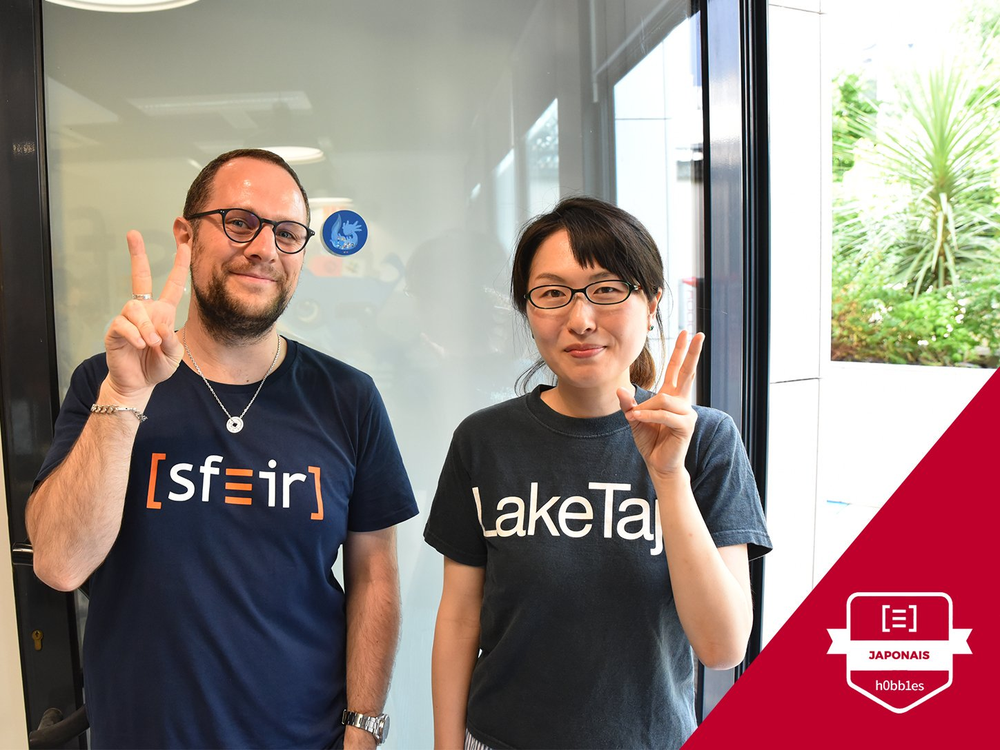

It's that time again...

This year was not an easy one for me, switching between too many contexts for too long. This explains why I almost stopped coding outside of work I think. I am reassured when I read this like [this post from Julia Evans «Learning at work»](https://jvns.ca/blog/2017/08/06/learning-at-work/), especially this:

> Don’t learn programming languages/frameworks outside of work

On this blog I am often too negative... I really want to be more positive !

## Writing

I wrote a few things on this blog, and I want to write more (as always).

Once again, I contributed to the blog of [SFEIR](http://www.sfeir.com):

- An [interview](https://lemag.sfeir.com/interview-romain-maton/) of [Romain Maton](https://twitter.com/rmat0n) at [Devoxx France](http://devoxx.fr/).
- An [interview](https://lemag.sfeir.com/interview-jaana-b-dogan-go/) of [jbd](https://twitter.com/rakyll) at [dotGo](https://www.dotgo.eu/).
- A soon to be release interview of [Tim Carry](https://twitter.com/pixelastic) at [dotCSS](https://www.dotcss.io/).
- A it-will-be-release-some-day interview of [Clever Cloud](https://www.clever-cloud.com/)'s [Quentin Adam](https://twitter.com/waxzce) at [Devoxx France](http://devoxx.fr/).

I also joined the [french gopher](https://frenchgo.fr/) initiative to create french content about the Go programming language:

- An [interview](https://frenchgo.fr/2017/11/interview-jbd-dotgo-2017/) of [jbd](https://twitter.com/rakyll) at [dotGo](https://www.dotgo.eu/).
- A [translation article](https://frenchgo.fr/2017/12/quel-est-le-mot-cle-le-plus-courant-dans-la-librairie-standard-go-/) of [Francesc](https://medium.com/@francesc/whats-the-most-common-identifier-in-go-s-stdlib-e468f3c9c7d9) about the most common identifier in Go's stdlib.

## Speaking

I gave some talks internally:

- one about CSRF and how to apply the frontend part in most frameworks.
- an introduction to the Go Programming language and the tools around it.
- I organized a round table about the state of JavaScript.

I was really glad to be invited by [MiXiT](http://mixitconf.org/) to share my personal view on the (in)famous [JavaScript fatigue](https://medium.com/@ericclemmons/javascript-fatigue-48d4011b6fc4). That was a pretty cool experience and an amazing conference: [see it here](https://vimeo.com/215622626).

I will be speaking at [SnowCamp](http://snowcamp.io/) in a few weeks !

## Teaching

That is a new thing in this yearly posts ! At SFEIR we have some trainings called [SFEIR School](http://school.sfeir.com/); they are free and open to everyone, we give 2 of them every month !

### Node.js

I worked on a [Node.js training](https://school.sfeir.com/project/snj200/) and gave it twice, another colleague gave it once. It was a good experience.

### Go

I was the trainer ([Sébastien](https://twitter.com/sebastienfriess)) 's assistant for a one-day training about the Go Programming Language. Super cool !

### Japanese

We create a SFEIR School with my wife: an introduction to the Japanese language !



### Magic

I spent too much time on youtube watching magic videos... So I started learning it, and we organized with my colleague [Rudy](https://twitter.com/rudy_weber/) a SFEIR School about magic !

The following video is exactly what we can not do at this time: [Shin Lim's EPIC Return to Penn & Teller // Season 4](https://www.youtube.com/watch?v=thIlxChNYqk)

## Programming

That was a lazy year. I learn to disconnect when I am at home, I will tell you more about that soon.

[beulogue](https://www.npmjs.com/package/beulogue) has been discontinued. That was fun. Here is the final source code:

```javascript
"use strict";

const path = require("path");

const pkg = require(path.resolve(__dirname, "./package.json"));

console.log(`
  beulogue v${pkg.version} #EOL
  =====================

  Beulogue was a nice experiment, and it's the end. Peace.

  Go get a real static site generator at https://gohugo.io/ or find one at https://www.staticgen.com/ !
`);
```

This blog is currently built using Hugo, which is awesome !

I updated [jisho-go](https://github.com/SiegfriedEhret/jisho-go). It works on my computer :p

## Computers and stuff

I switched my work computer for a Dell XPS 13 (using Arch Linux), and it is pretty cool.

I finally managed to use mutt with Fastmail. This year I will configure it with my Gmail accounts :)

I switched to Firefox, I hope I will be able to switch to [qutebrowser](https://qutebrowser.org/) for real this year.

I still want to learn ClojureScript.

Here is a list of things I will not spend my personal time on:

- Chatbots and assistants
- Mobile
- Blockchain

## Various

Last year I wrote that I wanted to get my black belt in karate. I got it !

I read some books, and I still want to read more.

Cool stuff I watched:

- Stranger Things 2
- Dark
- Preacher
- Rick & Morty Season 3
- The Good Place
- Baby Driver
- Creepy

Things I want to watch:

- The Handmaid's Tale
- American Vandal
- Norsemen
- It

And the album of the year:


[Listen on bandcamp](https://openmikeeagle360.bandcamp.com/album/brick-body-kids-still-daydream).

## Happy new year !

As I say every year:

> Happy new year to everybody who will have a happy year. For the others, stay strong and let's hope 2019 will be here promptly.
