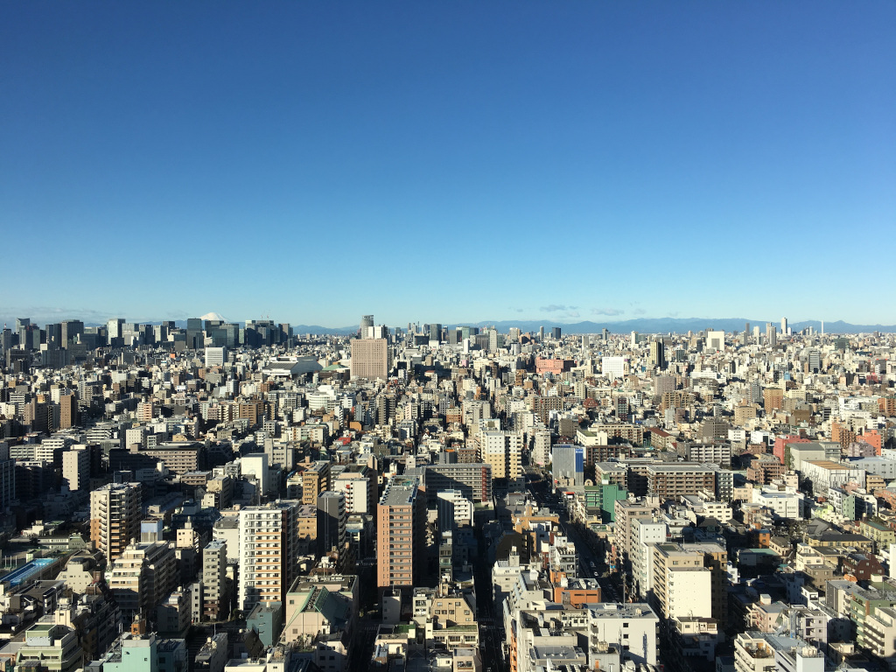
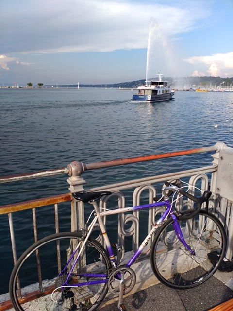
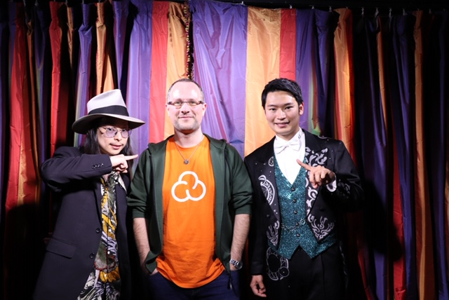

It's that time again... 2019 has been crazy!

## Life in Japan

At the end of 2018 we moved to Tokyo where I joined MetLife Japan.

Before moving there I spent some time with recruiters on Skype etc and I finally went with Robert Walters to join a superb team with people from everywhere. We worked on a Digital Health Engagement Platform. It was the 2nd Proof of Concept before doing it for real with the Global MetLife approved software.

We played with Java and React for this and it was super cool. We were working in a agile way and it worked well, and we had regular sprint celebrations together.

When I arrived I received 2 computers: a windows brick to check my MetLife mails and a MacBook to actually work :smile:.

The view was nice also (click on the image to get the big version): will you find the Mount Fuji?

Around the place (it is near Kinshichō, a few stations east of Akihabara) there was a lot of nice restaurants, including interesting ramen shops and a home-like cooking with specialities from the Akita region (known as Andrew's Secret Place).

I only stayed there 3 months because my wife got a great opporunity to join the World Health Organization so...

## Life in Switzerland

We arrived in Geneva in the beginning of April. My wife started to work directly, and I started looking for an apartment. Some friends told us that finding an apartment to rent in Geneva is an impossible mission. We were super lucky and found a nice place quite easily.

I also joined [SonarSource](https://sonarsource.com/) (thanks Didier for the contact!) to work on [SonarCloud](https://sonarcloud.io/). The team here is also super cool! I am learning a lot and I like the way we are organized (flat organization, collective intelligence...).

We are in Geneva and we also have an office in France (I went there) and also in Austin (I hope I'll be able to go there!).

I bought a bicycle last summer:

And it took me:

- To work :)
- Up to the [Mount Salève](https://www.cols-cyclisme.com/jura/france/mont-saleve-depuis-annemasse-c195.htm) (on the third attempt).
- Up to the [Col de la Faucille](https://www.cols-cyclisme.com/jura/france/col-de-la-faucille-depuis-gex-c587.htm)
- From Geneva to Montreux (~90 kilometers)

## Conferences

I gave a few talks:

- About Svelte and Sapper at [Devoxx France](https://www.youtube.com/watch?v=VyUpXyQHaAs) and [BlendWebMix](https://www.youtube.com/watch?v=JujxX2F7Jnk) (both in French).
- About getting some superpowers with your terminal at [Voxxed Days Ticino](https://www.youtube.com/watch?v=ZVv4klOho2M) (in English) and [Jug Summer Camp](https://www.youtube.com/watch?v=DZcvLvKL-g0) (in French).
- About Up, to make serverless problemless at [Devoxx Belgium](https://www.youtube.com/watch?v=EHS1SkVCk2c).

I went to [Voxxed Days CERN](https://voxxeddays.com/cern/) and it was great!

I also joined the CFP committee for Devoxx France for the fourth year (I think ^^). It is a nice way to have stuff to do during the winter evenings.

## Programming

I learnt so much at MetLife, going back into some Java, really diving into React and particularly Redux and Redux Sagas to kick [dva](https://github.com/dvajs/dva) out of the project.

At SonarSource we use TypeScript on the frontend. That was hard in the beginning, it is getting better!

I still spend my personal time on others things than programming. I spent some time this year to dig into [Crystal](https://crystal-lang.org/) and I wrote [beulogue](https://github.com/SiegfriedEhret/beulogue/), the static site generator for the website you are reading.

## Various

### Music

Cool stuff I listened:

- [Anderson .Paak - Ventura](https://www.youtube.com/watch?v=7Jj83FOlBF8)
- [Ariana Grande - thank u, next](https://www.youtube.com/watch?v=gl1aHhXnN1k)
- [Alcest - Spiritual Instincts](https://www.youtube.com/watch?v=69fnUZhV8SI)
- [Billie Eilish - WHEN WE ALL FALL ASLEEP, WHERE DO WE GO?](https://www.youtube.com/watch?v=-PZsSWwc9xA)
- [Billy Woods & Kenny Segal - Hiding Places](https://www.youtube.com/watch?v=83F4JpVu61k)
- [Borknagar, True North](https://www.youtube.com/watch?v=NAKWe0DkBsE)
- [BROCKHAMPTON - GINGER](https://www.youtube.com/watch?v=30XN_hZLNUg)
- [Carly Rae Jepsen ‎- Dedicated](https://www.youtube.com/watch?v=CnGjfxJqf6I)
- [clipping. - There Existed an Addiction to Blood](https://www.youtube.com/watch?v=fIrpLBShe1A)
- [Devin Townsend - Empath](https://www.youtube.com/watch?v=1n7uvokARQ4)
- [Freddie Gibbs & Madlib - Bandana](https://www.youtube.com/watch?v=u8R7fmLYgi4)
- [indigo la End — 濡れゆく私小説](https://www.youtube.com/watch?v=84zftzaVBOE)
- [Korn - The Nothing](https://www.youtube.com/watch?v=As8x9xqdCtc)
- [Malibu Ken - Malibu Ken](https://www.youtube.com/watch?v=qgOYDTkUZsk)
- [Open Mike Eagle, Closed Sessions, BoatHouse - Whiskey and Push-Ups](https://www.youtube.com/watch?v=CvOLcQam48s) (single)
- [Puppetmastaz - Sweet Sugar Rush](https://www.youtube.com/watch?v=9_k27_olesM)
- [Rotting Christ - The Heretics](https://www.youtube.com/watch?v=R2Bt38pbvlo)
- [Sakanaction - 834.194](https://www.youtube.com/watch?v=BxqYUbNR-c0)
- [Sunn O))) - Pyroclasts](https://www.youtube.com/watch?v=Y20qC3qgpps), and Life Metal
- [The Mirraz - Saturation.Now](https://www.youtube.com/watch?v=ga8q_-7m21E)
- [Thylacine - Roads - Vol.1](https://www.youtube.com/watch?v=d_Zj6thTWE0)
- [Tyler, the Creator - IGOR](https://www.youtube.com/watch?v=HmAsUQEFYGI)
- [Zeal & Ardor - Live in London](https://www.youtube.com/watch?v=HT4S7lTmzVU)

Below my expectations:

- Babymetal - Metal Galaxy
- Muse - Simulation Theory
- Rammstein - Rammstein
- Tool - Fear Inoculum
- Slipknot - We Are Not Your Kind

### Videos

Cool stuff I watched:

- [Alita: Battle Angel](https://www.rottentomatoes.com/m/alita_battle_angel): better than expected.
- [Brooklyn Nine-Nine: Season 6](https://www.rottentomatoes.com/tv/brooklyn_nine_nine/s06): still funny.
- [Captain Marvel](https://www.rottentomatoes.com/m/captain_marvel/): better than expected.
- [Dark: Season 2](https://www.rottentomatoes.com/tv/dark): please season 3, come to me!
- [Good Boys](https://www.rottentomatoes.com/m/good_boys_2019/): superbad with younger kids, still nice.
- [His Dark Materials: Season 1](https://www.rottentomatoes.com/tv/his_dark_materials/s01/): that was cool.
- [John Wick: Chapter 3 - Parabellum](https://www.rottentomatoes.com/m/john_wick_chapter_3_parabellum/): John Wick FTW.
- [Joker](https://www.rottentomatoes.com/m/joker_2019): Joachim Phoenix is amazing.
- [Long Shot](https://www.rottentomatoes.com/m/long_shot_2019/): it is fun.
- [One Cut of the Dead (Kamera o tomeru na!)](https://www.rottentomatoes.com/m/one_cut_of_the_dead/): great movie!
- [Parasite (Gisaengchung)](https://www.rottentomatoes.com/m/parasite_2019/): not sure what I watched ^^'
- [Ready or Not](https://www.rottentomatoes.com/m/ready_or_not_2019/): super cool!
- [Shazam!](https://www.rottentomatoes.com/m/shazam/): a great super-hero movie.
- [Stranger Things: Season 3](https://www.rottentomatoes.com/tv/stranger_things/s03): still nice.
- [The Boys: Season 1](https://www.rottentomatoes.com/tv/the_boys_2019): that was interesting, and crazy.
- [Chilling Adventures of Sabrina: Part 2](https://www.rottentomatoes.com/tv/chilling_adventures_of_sabrina/s02): the atmosphere is great.
- [The Good Place: Season 4](https://www.rottentomatoes.com/tv/the_good_place/s04/): can't wait for the real end in 2020!
- [The Kid Who Would Be King](https://www.rottentomatoes.com/m/the_kid_who_would_be_king/): actually cool kid movie!
- [Toy Story 4](https://www.rottentomatoes.com/m/toy_story_4/): [Toy Story is my jam!](https://www.youtube.com/watch?v=HxXY4dv3ILQ)
- [Watchmen: Season 1](https://www.rottentomatoes.com/tv/watchmen/s01/): that was cool!
- [Us](https://www.rottentomatoes.com/m/us_2019/): scary things are scary.

Below my expectations:

- [Avengers: Endgame](https://www.rottentomatoes.com/m/avengers_endgame/): meh.
- [Gemini Man](https://www.rottentomatoes.com/m/gemini_man_2019): that sucked.
- [Godzilla: King of the Monsters](https://www.rottentomatoes.com/m/godzilla_king_of_the_monsters_2019): meh.
- [Mortal Engines](https://www.rottentomatoes.com/m/mortal_engines): meh.
- [The Lego Movie 2: The Second Part](https://www.rottentomatoes.com/m/the_lego_movie_2_the_second_part): does not have the magic of the first one.
- [The Mandalorian: Season 1](https://www.rottentomatoes.com/tv/the_mandalorian/s01/): that was not bad, but I think the success is only because "it is Star Wars".
- [X-Men: Dark Phoenix](https://www.rottentomatoes.com/m/dark_phoenix): meh.

Things I want to watch:

- [Fast Color](https://www.rottentomatoes.com/m/fast_color/)
- [For All Mankind](https://www.rottentomatoes.com/tv/for_all_mankind)
- [Ford v Ferrari](https://www.rottentomatoes.com/m/ford_v_ferrari/)
- [In Fabric](https://www.rottentomatoes.com/m/in_fabric)
- [Midsommar](https://www.rottentomatoes.com/m/midsommar/)
- [Once Upon a Time In Hollywood](https://www.rottentomatoes.com/m/once_upon_a_time_in_hollywood/)
- [Servant: Season 1](https://www.rottentomatoes.com/tv/servant/s01)
- [The Irishman](https://www.rottentomatoes.com/m/the_irishman/)
- [The Lighthouse](https://www.rottentomatoes.com/m/the_lighthouse_2019/)
- [Star Wars: Episode IX - The Rise of Skywalker](https://www.rottentomatoes.com/m/star_wars_the_rise_of_skywalker)

## What to expect in 2020?

### JavaScript & flavors

It will continue to grow. Also, the number of `#` will increase in the next few years.

- In the [class fields proposal](https://github.com/tc39/proposal-class-fields) (in stage 3), the private fields will be prefixed with `#`.
- In the [record and tuple proposal](https://github.com/tc39/proposal-record-tuple) (in stage 1), records `#{...}` and tuples `#[...]` also use `#`.

Will JavaScript evolve into a [brainfuck](https://en.wikipedia.org/wiki/Brainfuck)-like language where we code mostly with `#`? Only time will tell...

Oh [TypeScript](https://www.typescriptlang.org/). I do not understand why people are so crazy about it. Yes, it helps. But there are a few downsides:

- Typings: react is currently at version 16.12.0, and the typings are at version 16.9.17. You can not trust that.
- The typings for react are on [npm here](https://www.npmjs.com/package/@types/react). The repository folder is [on DefinitelyTYped](https://github.com/DefinitelyTyped/DefinitelyTyped/tree/master/types/react), but the repository is so huge that it is impossible to browse. And there is no changelog.
- When browsing code, to go to a dependency, by default it will take you to the typings definitions, not the actual code, and that is a problem when code is not written in TypeScript.

These problems could be solved... If everything is written in TypeScript. And this should not happen.

Alernatives:

- [Flow](https://flow.org/) is more a Facebook internal product than a public thing. That is sad, I was viewing Flow a more JavaScript-ish static type checker.
- [Reason](https://reasonml.github.io/) may grow a little bit, but it will not eat TypeScript.

### Frameworks

Angular will finally be released with Ivy by default, probably with Angular 9.

Backbone: a new version was released in 2019, I'd love to see more Backbone next year.

LitElement: rising from the ashes of Polymer, the lightweight «Web Component» thingie will continue to grow.

React will continue to grow... I hope it will leave some place for others.

Svelte will grow! And I feel that, maybe not in 2020 but in the next few years we will see that Svelte influence other frameworks with more things on the compiler side.

Vue 3 will be out and it is going to be great.

### I will do something in 2020

Writing on this blog. The «News from last month» posts where created to save some links for myself, it seems some people are going through it (thanks!). I will try to write on other things sometimes.

Hopefully I'll keep on sharing stuff I learn in conferences.

I will continue to learn magic :tophat: :rabbit:. This year I met [Takumi Takahashi](https://www.youtube.com/watch?v=ri61lcjDkG4) and that was amazing!

I will continue to explore Crystal for a bit, I have a few ideas... And I'll probably start (again) my secret project with Svelte & Sapper!

I will try to use Twitter less.

I joined a friend from work to one event in his [Go](<https://en.wikipedia.org/wiki/Go_(game)>) club, I'll try to go there more!

I will cycle in 2020!

And I am starting 2020 with a Spongebob Squarepants marathon! :smile:

## Finally

Thanks Oleg for reading this every year <3.

## Happy new year!

> Happy new year to everybody who will have a happy year. For the others, stay strong and let's hope 2021 will be here promptly. Please be good, fair and funny.
