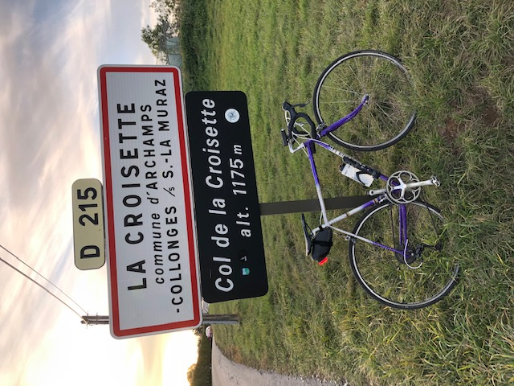

Hello, I hope you are doing well.

## Still in Switzerland!

We enjoy living in Geneva (even with COVID restrictions). The city is nice and it is easy go get out of it by bike. We changed our plans for the summer holidays, we went to the other side of Switzerland instead of Japan. That was amazing! We took 2 panoramic trains and visited beautiful places.

- [Bernina Express](https://www.rhb.ch/en/panoramic-trains/bernina-express)
- [Gotthard Panorama Express](https://www.myswitzerland.com/en/experiences/gotthard-panorama-express/)
- [Chur](https://www.chur.ch/)
- [Pontresina](https://www.pontresina.ch/)
- [Lugano](https://www.lugano.ch/)

I spent most of the year at SonarSource, working on [SonarCloud](https://sonarcloud.io/) and it was great, but I chose another way.

[The job offer for the same position is still online, apply now!](https://www.sonarsource.com/company/jobs/front-sc)

I was slacking on LinkedIn in the summer and found an interesting opportunity at the CyberPeace Institute and I started there early November. The [CyberPeace Institute](https://cyberpeaceinstitute.org/) is a non-governmental organization based in Geneva working to help achieving "A Cyberspace at Peace for Everyone, Everywhere". I joined a multidisciplinary team and we have a huge roadmap for 2021. Quite exciting!

In 2019 I got a bike and 2020 was really cool, Strava said I did 3593 kilometers! [My Strava profile](https://www.strava.com/athletes/45491558)

This old bike suffered with me to the top of the few mountains around Geneva, and around Lake Geneva twice!

## Conferences

2020 was a sad year for everything, including events.

I was selected for a talk « Coder avec Crystal pour ne pas perdre la boule » at Devoxx France and BreizhCamp which were cancelled. I was invited by Les Rendez-Vous des Speakers to give it for Halloween, that was super fun (and strange, it was the first time I gave a talk from my home).

- [Devoxx France](http://devoxx.fr/)
- [BreizhCamp](https://www.breizhcamp.org/)
- [Les Rendez-Vous des Speakers](https://rdv-speakers.fr/)

## Projects

I kept on playing with Crystal and kept on improving beulogue, my very own static site generator. I also created brrr, an experiment to get our of brew. They have their own Docker image and building/deploying docs for both projects are automated using GitHub Actions.

- [Crystal](https://crystal-lang.org/)
- [beulogue](https://github.com/SiegfriedEhret/beulogue/)
- [brrr](https://github.com/nyrst/brrr/)

I finally found the time to try Nim and nimige was born. It is a very basic and experimental Gemini server.

- [Nim](https://nim-lang.org/)
- [nimige, a server for Gemini](https://git.sr.ht/~siegfriedehret/nimige)
- [Gemini](https://gemini.circumlunar.space/)

As usual, great success: made by 1 dev for 1 dev!

I send a few pull requests to fix typos in some projects, let's continue to make open source projects better, one typo at a time.

## Other things

### Music

- [Blu & Exiles - Miles (I can't count how many times I have played this album)](https://bluandexile.bandcamp.com/album/miles)
- [Boldy James / Sterling Toles - Manger on McNichols (this is a great album)](https://sector7grecordings.bandcamp.com/album/manger-on-mcnichols)
- [Marc Rebillet (this dude is so good! :D)](https://www.youtube.com/user/marcrebillet)
- [Déluge - Ægo Templo (finally a good metal album this year!)](https://wearedeluge.bandcamp.com/)
- [Bring Me The Horizon – Post Human : Survival Horror (this one too!)](https://bmthorizon.co/PH.SH/)

### Videos

- [After Life (best tv show (ever?))](https://www.netflix.com/title/80998491)
- [Beastie Boys Story (AMAGAD that was amazing!)](https://tv.apple.com/movie/beastie-boys-story/umc.cmc.6d0mrskjsusw2jd2d228p88c2)
- [Dark (finally!!!)](https://www.netflix.com/title/80100172)
- [The Haunting Of Bly Manor (I don't watch many scary things, and that was good)](https://www.netflix.com/fr/title/81237854)
- [Rick and Morty (still great!)](https://en.wikipedia.org/wiki/Rick_and_Morty)
- [What We Do in the Shadows (one of the funniest thing I saw in 2020)](<https://en.wikipedia.org/wiki/What_We_Do_in_the_Shadows_(TV_series)>)

I want to see:

- [Feels Good Man](https://www.rottentomatoes.com/m/feels_good_man)
- [Tenet](<https://en.wikipedia.org/wiki/Tenet_(film)>)
- [The Undoing](https://www.hbo.com/the-undoing)
- [Tiger King](https://www.netflix.com/title/81115994)
- [Lovecraft Country](<https://en.wikipedia.org/wiki/Lovecraft_Country_(TV_series)>)
- [Solar Opposites](https://en.wikipedia.org/wiki/Solar_Opposites)
- [The Queen's Gambit](https://www.netflix.com/title/80234304)
- [Mank](https://www.mankmovie.com/synopsis/)

### Books

I don't read much (or I spend to much time reading stuff on the Internet)... I asked for a few books recommendations last year and I read nothing from the answers I got, but they are on my list! Anyway.

- [Competing with Unicorns](https://pragprog.com/titles/jragile/competing-with-unicorns/)
- [Factfulness: Ten Reasons We're Wrong About the World – and Why Things Are Better Than You Think](https://en.wikipedia.org/wiki/Factfulness:_Ten_Reasons_We%27re_Wrong_About_the_World_%E2%80%93_and_Why_Things_Are_Better_Than_You_Think)
- [Progressive Web App - Utilisez les standards du web pour développer vos applications mobiles](https://www.editions-eni.fr/livre/progressive-web-app-utilisez-les-standards-du-web-pour-developper-vos-applications-mobiles-9782409026348)
- [Never Split The Difference (ongoing)](https://info.blackswanltd.com/never-split-the-difference)
- [Capital and Ideology (ongoing)](https://en.wikipedia.org/wiki/Capital_and_Ideology)
- [de la poésie française (ongoing)](Anthologie)

I want to read:

- [Grokking Simplicity - Taming complex software with functional thinking](https://www.manning.com/books/grokking-simplicity)
- [Making Sense of Cyber Security](https://www.manning.com/books/making-sense-of-cyber-security)
- [The Story of the Streets](https://www.penguin.com.au/books/the-story-of-the-streets-9781446486733)
- [Worlds Beyond by Paul Curry](https://www.penguinmagic.com/p/6979)

### Games

- [Grand Mountain Adventure](https://www.toppluva.com/GrandMountainAdventure/)
- [MudRunner Mobile](https://www.focus-home.com/en-us/games/mudrunner-mobile)
- [Games made by Colin :heart:](https://colinbellino.itch.io/)

## What to expect in 2021?

Last year I added a few thoughts about tech. I don't really want to do this now, maybe later.

I just hope for something better than what happened in 2020.

- Starting 2021 with the end of Trump as a President of the USA is a good sign, right?
- The decline of COVID-19: officially (emergency) approved vaccines are getting distributed, and the few people who got the Russian one and are still alive can confirm that it works well
- Elon Musk sends complotists on Mars so we can be at peace here

On my side:

- I cooked a few cakes last year, maybe because of Dessertissime (see below), and I will continue
- I have a long list of classical music that I want to listen to
- I will keep on learning kanji!
- And maybe you browsed some of my "News from last month", I will continue that!

Take care and please go meet [Stéphane](https://www.dessertissime.fr/) and buy his cakes!

## Happy new year!

> Happy new year to everybody who will have a happy year. For the others, stay strong and let's hope 2022 will be here promptly. Please be good, fair and funny.

If you are still reading, know that I love you very much. Let's end this with a song from Marc Rebillet:

[I'M A FLAMINGO (LIVE)](https://www.youtube.com/watch?v=6hJv5yBLe9c)
