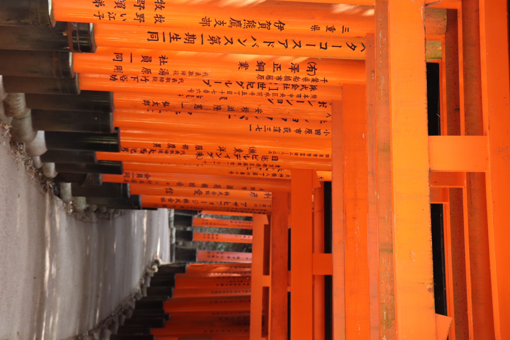
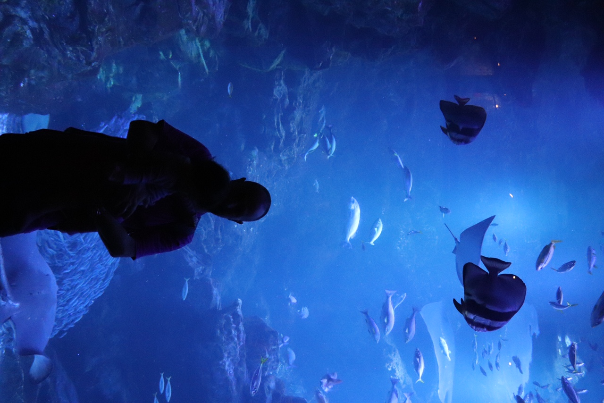
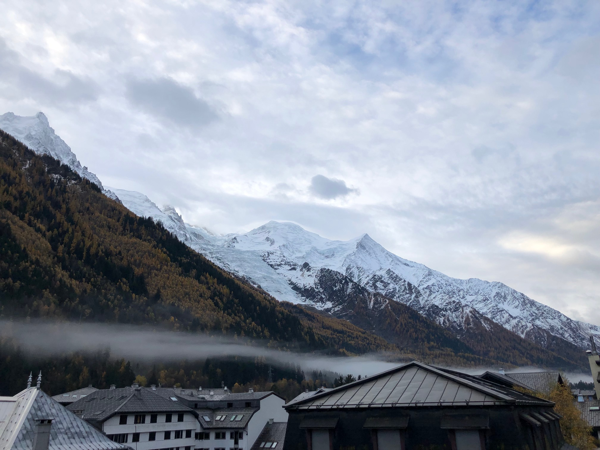

Hello folks, I hope you are doing well.

## Work

I planned to look into data management and pipelines. I did that with my 2 colleagues (the tech team is still small). We used [Airflow](https://airflow.apache.org/) (the [Google Cloud version](https://cloud.google.com/composer)), so I had to get into Python. I am not really into that language. Luckily we can use Airflow to orchestrate Docker images so we can code our tasks in other languages.

We had a lovely intern (coucou Noah !) who made an amazing job to create the [CyberPeace Miners](https://miners.cyberpeaceinstitute.org/), a map to explain some cybersecurity concepts in Minecraft. I made the website and some tooling around the project which ended up being not used (on-demand server creation and auto-removal after 30 minutes, all on Kubernetes).

I also had to take the harsh decision to stop the internship of another intern.

We released a new report (see [CyberPeace Analytical Report: - NGOs serving Humanity at risk: Cyber Threats affecting "International Geneva" | CyberPeace Institute](https://geneva.cyberpeace.ngo/)). I made the website, and it was my first experience playing with [Canvas](https://developer.mozilla.org/en-US/docs/Web/API/Canvas_API/Tutorial).

In 2024 the dev team will grow, I can’t wait!

## Not work

Tough year was tough.

Ayako (I am her husband) was pregnant and we learnt in June that nothing was there. This is called a [blighted ovum](https://en.wikipedia.org/wiki/Blighted_ovum). I think I got a small depression following that. Ayako was under the side effects of the pregnancy and did not feel it as strongly as I did. After a few months, we are now back to our normal state. I asked an AI to create an image to represent that, the result is the image at the top (I also used it for [News from last month (2023/07 edition)](https://ehret.me/news-from-last-month-202307-edition) when we got the news).

On top of that, and unrelated, I discovered 2 things regarding family members:

- They are just people
- It is ok to cut ties

On the nerdy side, I changed (again) the tools I use for my websites, I added some details at [beulogue v4](https://ehret.me/beulogue-v4), and more recently trying to bring back content to the repository, as I described in [Tina 🦙](https://ehret.me/tina).

I also made an advent calendar on my French website, the posts are available at [sieg.fr/ied/tag/avent-2023](https://sieg.fr/ied/tag/avent-2023).

I think I’ll continue to publish my "News from last month" posts, but I hope to make them a bit shorter (meaning I will sleep more and spend less time on the Internet).

I am still thinking about trying other format for some specific things. These will be in French.

And I continued to make biscuits and cakes, I have a huge book with some nice recipes. I need a bigger kitchen.

I cycled a bit more this year. Not often, but long rides. It felt good. I did the [tour du Léman](https://www.komoot.com/fr-fr/tour/1211931665) (167km), went to [the Salève and in the countryside](https://www.komoot.com/fr-fr/tour/1313191323) (83km), and to [Martigny](https://www.komoot.com/fr-fr/tour/1328745883) (133km). In 2024 I want to make a 200km ride because why not.

And we moved Ayako’s email out of Gmail to a Fastmail account (if you want one, [click my referral link!](https://ref.fm/u10904521)). Amazing!

## Travels

We went to Japan to see the family. We went to Tokyo and Kyoto. Here is a view of the [torii gates](https://en.wikipedia.org/wiki/Torii) in Fushimi Inari-taisha:

The aquarium in Kyoto is great! Here is a picture of me and my daughter:

We also went to Chamonix to celebrate the 2 years of our daughter, we had a nice view:

Also: Brussels (where I did some babysitting while Ayako gave a course), Burgundy and Paris to meet some friends, Saillon to enjoy a nice restaurant and the pool with our daughter, and Nice for Christmas

## Entertainment

### Music

I have a [Rate Your Music account](https://rateyourmusic.com/list/SiegfriedEhret/) and made [a list of nice albums](https://rateyourmusic.com/list/SiegfriedEhret/2023-nice-albums/).

My top albums of the year (ordered by release date, not preference):

- [Dogsbody by Model/Actriz (Album, Noise Rock)](https://rateyourmusic.com/release/album/model_actriz/dogsbody/)
- [UGLY by slowthai (Album, Post-Punk)](https://rateyourmusic.com/release/album/slowthai/ugly/)
- [10,000 gecs by 100 gecs (Album, Alternative Rock)](https://rateyourmusic.com/release/album/100-gecs/10_000-gecs-3/)
- [Scaring the Hoes by JPEGMAFIA x Danny Brown (Album, Experimental Hip Hop)](https://rateyourmusic.com/release/album/jpegmafia-x-danny-brown/scaring-the-hoes/)
- [93696 by Liturgy (Album, Avant-Garde Metal)](https://rateyourmusic.com/release/album/liturgy/93696/)
- [Maps by billy woods & Kenny Segal (Album, Abstract Hip Hop)](https://rateyourmusic.com/release/album/billy-woods-kenny-segal/maps/)
- [Scaring the Hoes: DLC Pack by JPEGMAFIA x Danny Brown (EP, Hardcore Hip Hop)](https://rateyourmusic.com/release/ep/jpegmafia-x-danny-brown/scaring-the-hoes-dlc-pack/)
- [Struggler by Genesis Owusu (Album, Post-Punk Revival)](https://rateyourmusic.com/release/album/genesis-owusu/struggler/)
- [HELLMODE by Jeff Rosenstock (Album, Indie Rock)](https://rateyourmusic.com/release/album/jeff-rosenstock/hellmode/)
- [We Buy Diabetic Test Strips by Armand Hammer (Album, Experimental Hip Hop)](https://rateyourmusic.com/release/album/armand-hammer/we-buy-diabetic-test-strips/)
- [INSAINT by 春ねむり \[Haru Nemuri\] (EP, J-Rock)](https://rateyourmusic.com/release/ep/%E6%98%A5%E3%81%AD%E3%82%80%E3%82%8A/insaint/)
- [Integrated Tech Solutions by Aesop Rock (Album, Abstract Hip Hop)](https://rateyourmusic.com/release/album/aesop-rock/integrated-tech-solutions/) (my favorite album of the year!)
- [14K Figaro by Wiki & Tony Seltzer (Album, East Coast Hip Hop)](https://rateyourmusic.com/release/album/wiki-tony-seltzer/14k-figaro/)
- [The Rime of Memory by Panopticon (Album, Atmospheric Black Metal)](https://rateyourmusic.com/release/album/panopticon/the-rime-of-memory/)

The song of the year is [Pomme de reinette et pomme d’api - YouTube](https://www.youtube.com/watch?v=ZFc1HR8zghY), my daughter loves it.

### Videos

I have a [letterboxd account](https://letterboxd.com/siegfriedehret/)

I did not watch many movies this year, here are some nice ones:

- [Lunana: A Yak in the Classroom (2019)](https://letterboxd.com/film/lunana-a-yak-in-the-classroom/)
- [Puss in Boots: The Last Wish (2022)](https://letterboxd.com/film/puss-in-boots-the-last-wish/)
- [Beyond the Infinite Two Minutes (2020)](https://letterboxd.com/film/beyond-the-infinite-two-minutes/)
- [Woman (2019)](https://letterboxd.com/film/woman-2019/)
- [John Wick: Chapter 4 (2023)](https://letterboxd.com/film/john-wick-chapter-4/)
- [Barbie (2023)](https://letterboxd.com/film/barbie/)
- [Rear Window (1954)](https://letterboxd.com/film/rear-window/)

I have not yet finished Oppenheimer, this is soooo long.

I still found time to watch some "old" tv shows:

- [Community (TV series) - Wikipedia](<https://en.wikipedia.org/wiki/Community_(TV_series)>)
- [Fringe (TV series) - Wikipedia](<https://en.wikipedia.org/wiki/Fringe_(TV_series)>)
- [House (TV series) - Wikipedia](<https://en.wikipedia.org/wiki/House_(TV_series)>) (ongoing)

### Books

I have not read much books this year, I spend to much time reading stuff on the Internet. I already have some on my bookshelf waiting for me :).

My favorite book of the year is [The Suitcase by Chris Naylor-Ballesteros](https://nosycrow.com/product/the-suitcase/).

### Games

Last year I started GTA5, and I did continue playing a bit but the progress is very slow.

Since we played some Minecraft at work, I played some Minecraft at home. And I defeated the Ender Dragon! (I bought Minecraft 12 years ago ^^).

I don’t have much time to play but my birthday is coming soon and I would love a Steam Deck.

## Happy new year!

2023 was quite a terrible year. Here’s to continuing the trend for 2024! Cheers!

About new year resolution, I will try a pizza with some ananas to finally see if it is good or bad. I need to know.

A song for you: [Aesop Rock - Pigeonometry (Official Audio) - YouTube](https://www.youtube.com/watch?v=Xf0poQI8wSo)
