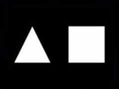

Welcome to the first part of these WebGL experiments !

## Intro

We are going to draw this:


(image from [NeHe website](http://nehe.gamedev.net/tutorial/lessons_01__05/22004/))

The demo page is [here](https://dev.ehret.me/webgl-experiments/experiment01.html) and the code is [here](https://github.com/SiegfriedEhret/webgl-experiments).

## Initialization

Let's initiate some stuff (from [Babylon.JS Basic Elements tutorial](https://github.com/BabylonJS/Babylon.js/wiki/02-Basic-elements)):

```javascript
var scene;

window.onload = function () {
  var canvas = document.getElementById("canvas");

  // Check support
  if (!BABYLON.Engine.isSupported()) {
    window.alert("Browser not supported");
  } else {
    // Babylon
    var engine = new BABYLON.Engine(canvas, true);

    //Creating scene
    scene = drawStuff(engine);

    scene.activeCamera.attachControl(canvas);

    // Once the scene is loaded, just register a render loop to render it
    engine.runRenderLoop(function () {
      scene.render();
    });

    // Resize
    window.addEventListener("resize", function () {
      engine.resize();
    });
  }
};
```

## Drawing stuff

The next function initializes the scene, with camera and light.
We are calling 2 functions, which are defined a little further.

```javascript
function drawStuff(engine) {
  //Creation of the scene
  var scene = new BABYLON.Scene(engine);
  scene.clearColor = new BABYLON.Color3(0, 0, 0);

  var camera = new BABYLON.FreeCamera(
    "Camera",
    new BABYLON.Vector3(0, 0, -10),
    scene,
  );
  var light0 = new BABYLON.PointLight(
    "Omni0",
    new BABYLON.Vector3(0, 100, 100),
    scene,
  );

  var triangle = drawTriangle(scene);
  var square = drawSquare(scene);

  triangle.position.x = -1.5;
  square.position.x = 1.5;

  return scene;
}
```

### Function: drawTriangle

```javascript
function drawTriangle(scene) {
```

Let's create a mesh for our element:

```javascript
var triangle = new BABYLON.Mesh("triangle", scene);
```

Then, the points for the triangle element:

````javascript
  var positions = [
    0, 1, 0,
    -1, -1, 0,
    1, -1, 0
  ];
```javascript
Next, we create the normals (orientation):
```javascript
  var normals = [
    1, 1, 1,
    1, 1, 1,
    1, 1, 1
  ];
````

And the indices, for the points order:

```javascript
var indices = [];
indices.push(0);
indices.push(1);
indices.push(2);
```

Finally, we load everything in our mesh:

```javascript
  triangle.setVerticesData(positions, BABYLON.VertexBuffer.PositionKind);
  triangle.setVerticesData(normals, BABYLON.VertexBuffer.NormalKind);
  triangle.setIndices(indices);

  return triangle;
}
```

That's it !

### Function drawSquare

The drawSquare looks a lot like the drawTriangle function.

```javascript
function drawSquare(scene) {
  var square = new BABYLON.Mesh('square', scene);

  var positions = [
    -1, -1, 0,
    1, -1, 0,
    1, 1, 0,
    -1, 1, 0
  ];

  var normals = [
    1, 1, 1,
    1, 1, 1,
    1, 1, 1,
    1, 1, 1
  ];
```

We add 2 series of indices to display our square using 2 triangles:

```javascript
var indices = [];
indices.push(0);
indices.push(1);
indices.push(2);

indices.push(0);
indices.push(2);
indices.push(3);
```

```javascript
  square.setVerticesData(positions, BABYLON.VertexBuffer.PositionKind);
  square.setVerticesData(normals, BABYLON.VertexBuffer.NormalKind);
  square.setIndices(indices);

  return square;
}
```

## The end

Are you lost ? Do you have a question or a comment ?
I'm sure I made a lot of mistakes, don't be mad.

See you at [part 2](https://ehret.me/webgl-experiment-part-2-adding-colour/) !
