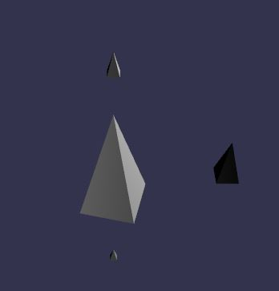

## Intro

In this experiment, we will create this:



The demo page is [here](https://dev.ehret.me/webgl-experiments/experiment06.html) and the code is [here](https://github.com/SiegfriedEhret/webgl-experiments).

## BabylonJS

I am refering about [BabylonJS](http://www.babylonjs.com/) since the beginning of my experiments. You **must** go see the examples on their websites, their level of awesomeness is [over 9000](https://www.youtube.com/watch?v=SiMHTK15Pik).

The framework is open source, made by people from Microsoft, using PC with Windows (true story; seriously, how can people code with Apple keyboards ?).

## Let's add a pyramid generator

BabylonJS source code is available on [GitHub](https://github.com/BabylonJS/Babylon.js).

The [Mesh class](https://github.com/BabylonJS/Babylon.js/blob/master/Babylon/Mesh/babylon.mesh.js) contains the functions that can generate Boxes, Spheres etc.

We are going to add a function that creates a square-based pyramid **CreatePyramid4**. The function have 5 parameters:

- name: the name of our mesh (string)
- baseSize: the width (our height) of the base square (float)
- height: the height of the pyramid (float)
- scene: the scene where the pyramid will be added
- updatable: if the vertex buffer is dynamic (boolean)

```javascript
BABYLON.Mesh.CreatePyramid4 = function (name, baseSize, height, scene, updatable) {
  var pyramid = new BABYLON.Mesh(name, scene);
```

Positions for the pyramid points:

```javascript
// Adding faces
var positions = [
  // Front face
  0,
  height / 2,
  0,
  baseSize / 2,
  -height / 2,
  baseSize / 2,
  -baseSize / 2,
  -height / 2,
  baseSize / 2,

  // Right face
  0,
  height / 2,
  0,
  baseSize / 2,
  -height / 2,
  -baseSize / 2,
  baseSize / 2,
  -height / 2,
  baseSize / 2,

  // Back face
  0,
  height / 2,
  0,
  -baseSize / 2,
  -height / 2,
  -baseSize / 2,
  baseSize / 2,
  -height / 2,
  -baseSize / 2,

  // Left face
  0,
  height / 2,
  0,
  -baseSize / 2,
  -height / 2,
  baseSize / 2,
  -baseSize / 2,
  -height / 2,
  -baseSize / 2,

  // Bottom face
  -baseSize / 2,
  -height / 2,
  baseSize / 2,
  baseSize / 2,
  -height / 2,
  baseSize / 2,
  baseSize / 2,
  -height / 2,
  -baseSize / 2,
  -baseSize / 2,
  -height / 2,
  -baseSize / 2,
];
```

Normals for the faces:

```javascript
var normals = [
  height,
  baseSize / 2,
  0,
  height,
  baseSize / 2,
  0,
  height,
  baseSize / 2,
  0,

  0,
  baseSize / 2,
  height,
  0,
  baseSize / 2,
  height,
  0,
  baseSize / 2,
  height,

  -height,
  baseSize / 2,
  0,
  -height,
  baseSize / 2,
  0,
  -height,
  baseSize / 2,
  0,

  0,
  baseSize / 2,
  -height,
  0,
  baseSize / 2,
  -height,
  0,
  baseSize / 2,
  -height,

  0,
  -1,
  0,
  0,
  -1,
  0,
  0,
  -1,
  0,
  0,
  -1,
  0,
];
```

Indices (order of points when creating the faces) and uvs (coordonnées de textures):

```javascript
var indices = [];
var uvs = [];
var i = 0;
```

For the 4 faces pointing to the top of the pyramid

```javascript
while (i < 12) {
  indices.push(i + 0);
  uvs.push(1.0, 1.0);
  indices.push(i + 1);
  uvs.push(0.0, 1.0);
  indices.push(i + 2);
  uvs.push(0.0, 0.0);
  i = i + 3;
}
```

And for the base:

```javascript
indices.push(12);
indices.push(13);
indices.push(14);

indices.push(12);
indices.push(14);
indices.push(15);

uvs.push(1.0, 1.0);
uvs.push(0.0, 1.0);
uvs.push(0.0, 0.0);
uvs.push(1.0, 0.0);
```

And we load everything in the mesh:

```javascript
  pyramid.setVerticesData(positions, BABYLON.VertexBuffer.PositionKind, updatable);
  pyramid.setVerticesData(normals, BABYLON.VertexBuffer.NormalKind, updatable);
  pyramid.setVerticesData(uvs, BABYLON.VertexBuffer.UVKind, updatable);
  pyramid.setIndices(indices);

  return pyramid;
}

```

### Demo time !

In the demo page is [here](https://dev.ehret.me/webgl-experiments/experiment06.html), I added 4 pyramids: a big one in the center, and 3 small along the axis:

```javascript
function drawStuff(engine) {
  var scene = new BABYLON.Scene(engine);
  //scene.clearColor = new BABYLON.Color3(0, 0, 0);

  var light = new BABYLON.PointLight("Omni", new BABYLON.Vector3(50, 100, 0), scene);
  var camera = new BABYLON.ArcRotateCamera("Camera", 0, 0.8, 100, new BABYLON.Vector3.Zero(), scene);
```

The big pyramid:

```javascript
var pyramid = BABYLON.Mesh.CreatePyramid4("pyramid", 10, 20, scene);
```

And the smaller ones:

```javascript
var formX = BABYLON.Mesh.CreatePyramid4("formX", 1, 2, scene);
var formY = BABYLON.Mesh.CreatePyramid4("formY", 2, 4, scene);
var formZ = BABYLON.Mesh.CreatePyramid4("formZ", 4, 8, scene);
```

Moved along different axis:

```javascript
formX.position.x = 20;
formY.position.y = 20;
formZ.position.z = 20;
```

And let's rotate our big pyramid:

```javascript
  rotate(pyramid);

  return scene;
}
```

### The end

We looked a little into BabylonJS source to add a small function.

They are tons and tons of stuff to see: cameras, lights, ...

More experiments to come ! Stay tuned !
